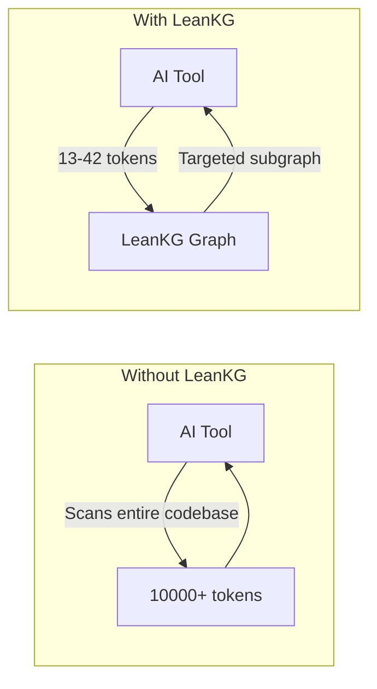
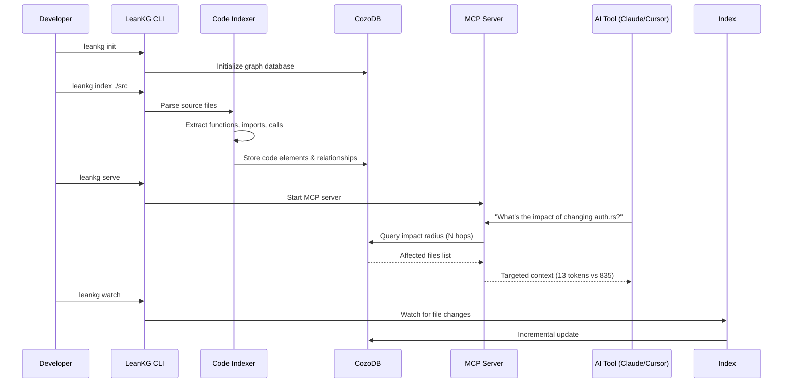
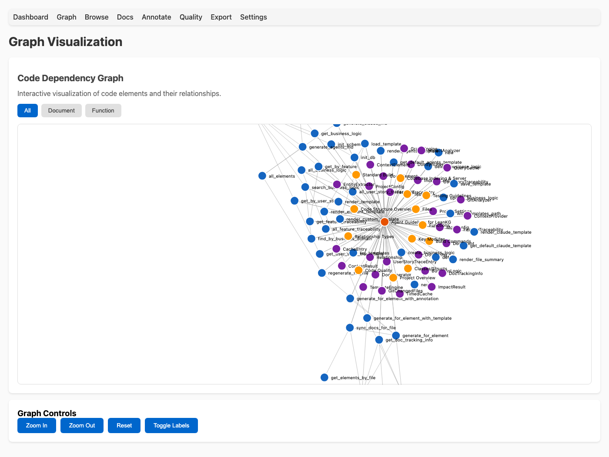

<p align="center">
  
</p>

# LeanKG

[](https://opensource.org/licenses/MIT)
[](https://www.rust-lang.org/)
[](https://crates.io/crates/leankg)

**Lightweight Knowledge Graph for AI-Assisted Development**

LeanKG is a local-first knowledge graph that gives AI coding tools accurate codebase context. It indexes your code, builds dependency graphs, generates documentation, and exposes an MCP server so tools like Cursor, OpenCode, and Claude Code can query the knowledge graph directly. No cloud services, no external databases -- everything runs on your machine with minimal resources.

---

## How LeanKG Helps



**Without LeanKG**: AI scans entire codebase, wasting tokens on irrelevant context.

**With LeanKG**: AI queries the knowledge graph for targeted context only.

---

## Installation

### One-Line Install (Recommended)

Install the LeanKG binary, configure MCP, and add agent instructions for your AI coding tool:

```bash
curl -fsSL https://raw.githubusercontent.com/FreePeak/LeanKG/main/scripts/install.sh | bash -s -- <target>
```

This installs:
1. LeanKG binary to `~/.local/bin`
2. MCP configuration for your AI tool
3. Agent instructions (LeanKG tool usage guidance) to the tool's config directory

**Supported targets:**

| Target | AI Tool | MCP Config | Agent Instructions |
|--------|---------|------------|-------------------|
| `opencode` | OpenCode AI | `~/.config/opencode/opencode.json` | `~/.config/opencode/AGENTS.md` |
| `cursor` | Cursor AI | `~/.cursor/mcp.json` | `~/.cursor/AGENTS.md` |
| `claude` | Claude Code/Desktop | `~/.config/claude/settings.json` | `~/.config/claude/CLAUDE.md` |
| `gemini` | Gemini CLI / Google Antigravity | `~/.config/gemini-cli/mcp.json` / `~/.gemini/antigravity/mcp_config.json` | `~/.gemini/GEMINI.md` |
| `kilo` | Kilo Code | `~/.config/kilo/kilo.json` | `~/.config/kilo/AGENTS.md` |

**Examples:**

```bash
# Install for OpenCode
curl -fsSL https://raw.githubusercontent.com/FreePeak/LeanKG/main/scripts/install.sh | bash -s -- opencode

# Install for Cursor
curl -fsSL https://raw.githubusercontent.com/FreePeak/LeanKG/main/scripts/install.sh | bash -s -- cursor

# Install for Claude Code
curl -fsSL https://raw.githubusercontent.com/FreePeak/LeanKG/main/scripts/install.sh | bash -s -- claude

# Install for Gemini CLI
curl -fsSL https://raw.githubusercontent.com/FreePeak/LeanKG/main/scripts/install.sh | bash -s -- gemini

# Install for Kilo Code
curl -fsSL https://raw.githubusercontent.com/FreePeak/LeanKG/main/scripts/install.sh | bash -s -- kilo

# Install for Google Antigravity
curl -fsSL https://raw.githubusercontent.com/FreePeak/LeanKG/main/scripts/install.sh | bash -s -- antigravity
```

### Install via Cargo

```bash
cargo install leankg
leankg --version
```

### Build from Source

```bash
git clone https://github.com/your-org/LeanKG.git
cd LeanKG
cargo build --release
```

---

## Update

To update LeanKG to the latest version, run the same install command:

```bash
curl -fsSL https://raw.githubusercontent.com/FreePeak/LeanKG/main/scripts/install.sh | bash -s -- update
```

This will replace the existing binary with the latest release while preserving your configuration.

---

## Quick Start

```bash
# 1. Initialize LeanKG in your project
leankg init

# 2. Index your codebase
leankg index ./src

# 3. Start the MCP server (for AI tools)
leankg serve

# 4. Start the Web UI (for visualization)
# Open http://localhost:8080 in your browser
leankg web

# 5. Compute impact radius for a file
leankg impact src/main.rs --depth 3

# 6. Check index status
leankg status
```

---

## How It Works



1. **Index** -- LeanKG parses your codebase and builds a graph of code elements (functions, classes, modules) and their relationships (imports, calls, tests).
2. **Query** -- AI tools query the graph via MCP instead of scanning files.
3. **Optimize** -- Get targeted context with ~99% token reduction.

---

## MCP Server Setup

See [MCP Setup](docs/mcp-setup.md) for detailed setup instructions for all supported AI tools.

---

## Agentic Instructions for AI Tools

LeanKG instructs AI coding agents to use LeanKG **first** for codebase queries.

### Quick Rule to Add Manually

Add this to your AI tool's instruction file:

```markdown
## MANDATORY: Use LeanKG First
Before ANY codebase search/navigation, use LeanKG tools:
1. `mcp_status` - check if ready
2. Use tool: `search_code`, `find_function`, `query_file`, `get_impact_radius`, `get_dependencies`, `get_dependents`, `get_tested_by`, `get_context`
3. Only fallback to grep/read if LeanKG fails

| Task | Use |
|------|-----|
| Where is X? | `search_code` or `find_function` |
| What breaks if I change Y? | `get_impact_radius` |
| What tests cover Y? | `get_tested_by` |
| How does X work? | `get_context` |
```

### Instruction Files (Auto-installed)

| Tool | File | Auto-install |
|------|------|--------------|
| Claude Code | `~/.config/claude/CLAUDE.md` | Yes |
| OpenCode | `~/.config/opencode/AGENTS.md` | Yes |
| Cursor | `~/.cursor/AGENTS.md` | Yes |
| KiloCode | `~/.config/kilo/AGENTS.md` | Yes |
| Codex | `~/.config/codex/AGENTS.md` | Yes |
| Gemini CLI | `~/.gemini/GEMINI.md` | Yes |
| Google Antigravity | `~/.gemini/GEMINI.md` | Yes |

See [Agentic Instructions](docs/agentic-instructions.md) for detailed setup.

### OpenCode Plugin (Auto-Trigger)

LeanKG includes an OpenCode plugin that **automatically injects LeanKG context into every prompt**. Add to your `opencode.json`:

```json
{
  "plugins": ["leankg@git+https://github.com/FreePeak/LeanKG.git"]
}
```

This makes LeanKG tools **always available** without manual activation. See [`.opencode/INSTALL.md`](.opencode/INSTALL.md) for details.

### Claude Code Plugin (Auto-Trigger)

LeanKG is available via the official Claude plugin marketplace:

```
/plugin install leankg@claude-plugins-official
```

Or register the marketplace:

```
/plugin marketplace add FreePeak/leankg-marketplace
/plugin install leankg@leankg-marketplace
```

See [`.claude-plugin/INSTALL.md`](.claude-plugin/INSTALL.md) for details.

### Cursor Plugin (Auto-Trigger)

LeanKG is available via the Cursor plugin marketplace:

```
/add-plugin leankg
```

See [`.cursor-plugin/INSTALL.md`](.cursor-plugin/INSTALL.md) for details.

### Gemini CLI / Google Antigravity (Auto-Trigger)

Install via gemini extensions:

```
gemini extensions install https://github.com/FreePeak/LeanKG
```

See [`GEMINI.md`](GEMINI.md) for context file details.

### Codex (Fetch Instructions)

Tell Codex:

```
Fetch and follow instructions from https://raw.githubusercontent.com/FreePeak/LeanKG/refs/heads/main/.codex/INSTALL.md
```

See [`.codex/INSTALL.md`](.codex/INSTALL.md) for details.

### Kilo Code (Fetch Instructions)

Tell Kilo Code:

```
Fetch and follow instructions from https://raw.githubusercontent.com/FreePeak/LeanKG/refs/heads/main/.kilo/INSTALL.md
```

See [`.kilo/INSTALL.md`](.kilo/INSTALL.md) for details.

---

## Highlights

- **Code Indexing** -- Parse and index Go, TypeScript, Python, and Rust codebases with tree-sitter.
- **Dependency Graph** -- Build call graphs with `IMPORTS`, `CALLS`, and `TESTED_BY` edges.
- **Impact Radius** -- Compute blast radius for any file to see downstream impact.
- **Auto Documentation** -- Generate markdown docs from code structure automatically.
- **MCP Server** -- Expose the graph via MCP protocol for AI tool integration.
- **File Watching** -- Watch for changes and incrementally update the index.
- **CLI** -- Single binary with init, index, serve, impact, and status commands.
- **Business Logic Mapping** -- Annotate code elements with business logic descriptions and link to features.
- **Traceability** -- Show feature-to-code and requirement-to-code traceability chains.
- **Documentation Mapping** -- Index docs/ directory, map doc references to code elements.
- **Graph Viewer** -- Visualize knowledge graph using standalone web UI.

---

## Web UI

Start the web UI with `leankg web` or `leankg serve` and open [http://localhost:8080](http://localhost:8080).

### Graph Viewer



The graph viewer provides an interactive visualization of your codebase's dependency graph. Filter by element type, zoom, pan, and click nodes for details.

See [Web UI](docs/web-ui.md) for detailed documentation.

---

## Auto-Indexing

LeanKG watches your codebase and automatically keeps the knowledge graph up-to-date. See [CLI Reference](docs/cli-reference.md#auto-indexing) for detailed commands.

---

## CLI Commands

For the complete CLI reference, see [CLI Reference](docs/cli-reference.md).

---

## MCP Tools

See [MCP Tools](docs/mcp-tools.md) for the complete list of available tools.

---

## Supported AI Tools

| Tool | Integration | Agent Instructions |
|------|-------------|-------------------|
| **Claude Code** | MCP | Yes (`CLAUDE.md`) |
| **OpenCode** | MCP | Yes (`AGENTS.md`) |
| **Cursor** | MCP | Yes (`AGENTS.md`) |
| **KiloCode** | MCP | Yes (`AGENTS.md`) |
| **Codex** | MCP | Yes (`AGENTS.md`) |
| **Google Antigravity** | MCP | Yes (`AGENTS.md`) |
| **Windsurf** | MCP | Not yet |
| **Gemini CLI** | MCP | Yes (`AGENTS.md`) |

---

## Roadmap

See [Roadmap](docs/roadmap.md) for detailed feature planning and implementation status.

---

## Requirements

- Rust 1.70+
- macOS or Linux

---

## Tech Stack & Project Structure

See [Tech Stack](docs/tech-stack.md) for architecture, tech stack details, supported languages, and project structure.

---

## License

MIT
