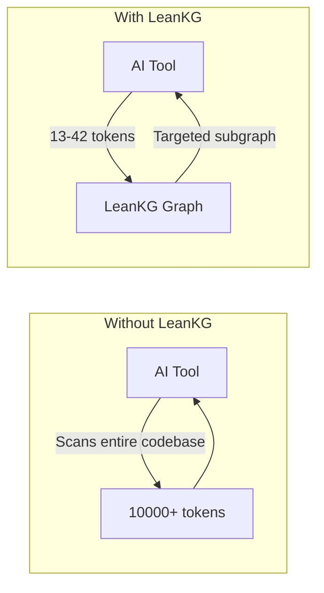
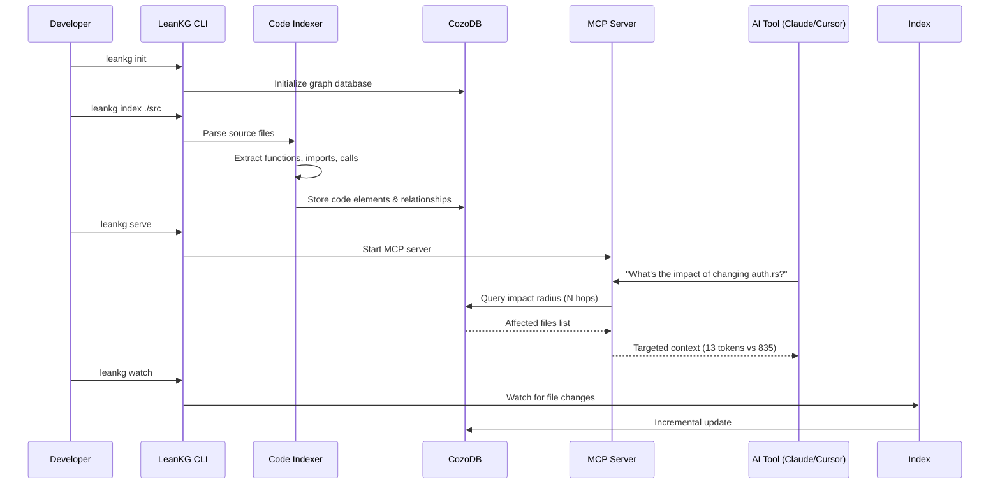
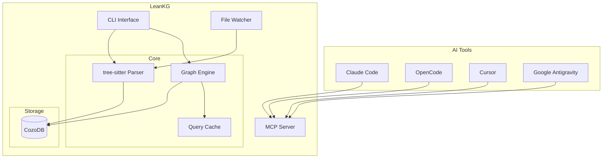

<p align="center">
  
</p>

# LeanKG

[](https://opensource.org/licenses/MIT)
[](https://www.rust-lang.org/)
[](https://crates.io/crates/leankg)

**Lightweight Knowledge Graph for AI-Assisted Development**

LeanKG is a local-first knowledge graph that gives AI coding tools accurate codebase context. It indexes your code, builds dependency graphs, generates documentation, and exposes an MCP server so tools like Cursor, OpenCode, and Claude Code can query the knowledge graph directly. No cloud services, no external databases -- everything runs on your machine with minimal resources.

---

## How LeanKG Helps



**Without LeanKG**: AI scans entire codebase, wasting tokens on irrelevant context.

**With LeanKG**: AI queries the knowledge graph for targeted context only.

---

## Installation

### One-Line Install (Recommended)

Install the LeanKG binary, configure MCP, and add agent instructions for your AI coding tool:

```bash
curl -fsSL https://raw.githubusercontent.com/FreePeak/LeanKG/main/scripts/install.sh | bash -s -- <target>
```

This installs:
1. LeanKG binary to `~/.local/bin`
2. MCP configuration for your AI tool
3. Agent instructions (LeanKG tool usage guidance) to the tool's config directory

**Supported targets:**

| Target | AI Tool | MCP Config | Agent Instructions |
|--------|---------|------------|-------------------|
| `opencode` | OpenCode AI | `~/.config/opencode/opencode.json` | `~/.config/opencode/AGENTS.md` |
| `cursor` | Cursor AI | `~/.cursor/mcp.json` | `~/.cursor/AGENTS.md` |
| `claude` | Claude Code/Desktop | `~/.config/claude/settings.json` | `~/.config/claude/CLAUDE.md` |
| `gemini` | Gemini CLI / Google Antigravity | `~/.config/gemini-cli/mcp.json` / `~/.gemini/antigravity/mcp_config.json` | `~/.gemini/GEMINI.md` |
| `kilo` | Kilo Code | `~/.config/kilo/kilo.json` | `~/.config/kilo/AGENTS.md` |

**Examples:**

```bash
# Install for OpenCode
curl -fsSL https://raw.githubusercontent.com/FreePeak/LeanKG/main/scripts/install.sh | bash -s -- opencode

# Install for Cursor
curl -fsSL https://raw.githubusercontent.com/FreePeak/LeanKG/main/scripts/install.sh | bash -s -- cursor

# Install for Claude Code
curl -fsSL https://raw.githubusercontent.com/FreePeak/LeanKG/main/scripts/install.sh | bash -s -- claude

# Install for Gemini CLI
curl -fsSL https://raw.githubusercontent.com/FreePeak/LeanKG/main/scripts/install.sh | bash -s -- gemini

# Install for Kilo Code
curl -fsSL https://raw.githubusercontent.com/FreePeak/LeanKG/main/scripts/install.sh | bash -s -- kilo

# Install for Google Antigravity
curl -fsSL https://raw.githubusercontent.com/FreePeak/LeanKG/main/scripts/install.sh | bash -s -- antigravity
```

### Install via Cargo

```bash
cargo install leankg
leankg --version
```

### Build from Source

```bash
git clone https://github.com/your-org/LeanKG.git
cd LeanKG
cargo build --release
```

---

## Update

To update LeanKG to the latest version, run the same install command:

```bash
curl -fsSL https://raw.githubusercontent.com/FreePeak/LeanKG/main/scripts/install.sh | bash -s -- update
```

This will replace the existing binary with the latest release while preserving your configuration.

---

## Quick Start

```bash
# 1. Initialize LeanKG in your project
leankg init

# 2. Index your codebase
leankg index ./src

# 3. Start the MCP server (for AI tools)
leankg serve

# 4. Start the Web UI (for visualization)
# Open http://localhost:8080 in your browser
leankg web

# 5. Compute impact radius for a file
leankg impact src/main.rs --depth 3

# 6. Check index status
leankg status
```

---

## How It Works



1. **Index** -- LeanKG parses your codebase and builds a graph of code elements (functions, classes, modules) and their relationships (imports, calls, tests).
2. **Query** -- AI tools query the graph via MCP instead of scanning files.
3. **Optimize** -- Get targeted context with ~99% token reduction.

---

## MCP Server Setup

LeanKG exposes a Model Context Protocol (MCP) server that AI tools can connect to.

### Automated Setup (Recommended)

Use the install script to install and configure MCP for your AI tool:

```bash
curl -fsSL https://raw.githubusercontent.com/FreePeak/LeanKG/main/scripts/install.sh | bash -s -- <target>
```

### Manual Setup

#### OpenCode AI

Add to `~/.config/opencode/opencode.json`:

```json
{
  "mcp": {
    "leankg_dev": {
      "type": "local",
      "command": ["leankg", "mcp-stdio", "--watch"],
      "enabled": true
    }
  }
}
```

#### Cursor AI

Add to `~/.cursor/mcp.json`:

```json
{
  "mcpServers": {
    "leankg": {
      "command": "leankg",
      "args": ["mcp-stdio", "--watch"]
    }
  }
}
```

#### Claude Code / Claude Desktop

Add to `~/.config/claude/settings.json`:

```json
{
  "mcpServers": {
    "leankg": {
      "command": "leankg",
      "args": ["mcp-stdio", "--watch"]
    }
  }
}
```

#### Gemini CLI

Add to `~/.config/gemini-cli/mcp.json`:

```json
{
  "mcpServers": {
    "leankg": {
      "command": "leankg",
      "args": ["mcp-stdio", "--watch"]
    }
  }
}
```

#### Google Antigravity

Add to `~/.gemini/antigravity/mcp_config.json`:

```json
{
  "mcpServers": [
    {
      "name": "leankg",
      "transport": "stdio",
      "command": "leankg",
      "args": ["mcp-stdio", "--watch"],
      "enabled": true
    }
  ]
}
```

#### Kilo Code

Add to `~/.config/kilo/kilo.json`:

```json
{
  "$schema": "https://kilo.ai/config.json",
  "mcp": {
    "leankg": {
      "type": "local",
      "command": ["leankg", "mcp-stdio", "--watch"],
      "enabled": true
    }
  }
}
```

### Starting the MCP Server

```bash
# Stdio mode with auto-indexing (for local AI tools)
leankg mcp-stdio --watch

# Stdio mode without auto-indexing
leankg mcp-stdio
```

---

## Agentic Instructions for AI Tools

LeanKG instructs AI coding agents to use LeanKG **first** for codebase queries.

### Quick Rule to Add Manually

Add this to your AI tool's instruction file:

```markdown
## MANDATORY: Use LeanKG First
Before ANY codebase search/navigation, use LeanKG tools:
1. `mcp_status` - check if ready
2. Use tool: `search_code`, `find_function`, `query_file`, `get_impact_radius`, `get_dependencies`, `get_dependents`, `get_tested_by`, `get_context`
3. Only fallback to grep/read if LeanKG fails

| Task | Use |
|------|-----|
| Where is X? | `search_code` or `find_function` |
| What breaks if I change Y? | `get_impact_radius` |
| What tests cover Y? | `get_tested_by` |
| How does X work? | `get_context` |
```

### Instruction Files (Auto-installed)

| Tool | File | Auto-install |
|------|------|--------------|
| Claude Code | `~/.config/claude/CLAUDE.md` | Yes |
| OpenCode | `~/.config/opencode/AGENTS.md` | Yes |
| Cursor | `~/.cursor/AGENTS.md` | Yes |
| KiloCode | `~/.config/kilo/AGENTS.md` | Yes |
| Codex | `~/.config/codex/AGENTS.md` | Yes |
| Gemini CLI | `~/.gemini/GEMINI.md` | Yes |
| Google Antigravity | `~/.gemini/GEMINI.md` | Yes |

See [Agentic Instructions](docs/agentic-instructions.md) for detailed setup.

### OpenCode Plugin (Auto-Trigger)

LeanKG includes an OpenCode plugin that **automatically injects LeanKG context into every prompt**. Add to your `opencode.json`:

```json
{
  "plugins": ["leankg@git+https://github.com/FreePeak/LeanKG.git"]
}
```

This makes LeanKG tools **always available** without manual activation. See [`.opencode/INSTALL.md`](.opencode/INSTALL.md) for details.

### Claude Code Plugin (Auto-Trigger)

LeanKG is available via the official Claude plugin marketplace:

```
/plugin install leankg@claude-plugins-official
```

Or register the marketplace:

```
/plugin marketplace add FreePeak/leankg-marketplace
/plugin install leankg@leankg-marketplace
```

See [`.claude-plugin/INSTALL.md`](.claude-plugin/INSTALL.md) for details.

### Cursor Plugin (Auto-Trigger)

LeanKG is available via the Cursor plugin marketplace:

```
/add-plugin leankg
```

See [`.cursor-plugin/INSTALL.md`](.cursor-plugin/INSTALL.md) for details.

### Gemini CLI / Google Antigravity (Auto-Trigger)

Install via gemini extensions:

```
gemini extensions install https://github.com/FreePeak/LeanKG
```

See [`GEMINI.md`](GEMINI.md) for context file details.

### Codex (Fetch Instructions)

Tell Codex:

```
Fetch and follow instructions from https://raw.githubusercontent.com/FreePeak/LeanKG/refs/heads/main/.codex/INSTALL.md
```

See [`.codex/INSTALL.md`](.codex/INSTALL.md) for details.

### Kilo Code (Fetch Instructions)

Tell Kilo Code:

```
Fetch and follow instructions from https://raw.githubusercontent.com/FreePeak/LeanKG/refs/heads/main/.kilo/INSTALL.md
```

See [`.kilo/INSTALL.md`](.kilo/INSTALL.md) for details.

---

## Highlights

- **Code Indexing** -- Parse and index Go, TypeScript, Python, and Rust codebases with tree-sitter.
- **Dependency Graph** -- Build call graphs with `IMPORTS`, `CALLS`, and `TESTED_BY` edges.
- **Impact Radius** -- Compute blast radius for any file to see downstream impact.
- **Auto Documentation** -- Generate markdown docs from code structure automatically.
- **MCP Server** -- Expose the graph via MCP protocol for AI tool integration.
- **File Watching** -- Watch for changes and incrementally update the index.
- **CLI** -- Single binary with init, index, serve, impact, and status commands.
- **Business Logic Mapping** -- Annotate code elements with business logic descriptions and link to features.
- **Traceability** -- Show feature-to-code and requirement-to-code traceability chains.
- **Documentation Mapping** -- Index docs/ directory, map doc references to code elements.
- **Graph Viewer** -- Visualize knowledge graph using standalone web UI.

---

## Web UI

LeanKG stores data in CozoDB. You can visualize and query your knowledge graph using the graph viewer.

### Prerequisites

Install CozoDB standalone server (v0.2 to match LeanKG's embedded version):

```bash
# Download from GitHub releases
curl -LO https://github.com/cozodb/cozo/releases/download/v0.2.2/cozoserver-0.2.2-aarch64-apple-darwin.gz
gunzip cozoserver-0.2.2-aarch64-apple-darwin.gz
chmod +x cozoserver-0.2.2-aarch64-apple-darwin
mv cozoserver-0.2.2-aarch64-apple-darwin ~/.local/bin/cozo-server
```

### Start CozoDB Server

```bash
# Start CozoDB pointing to your LeanKG database
cozo-server -e sqlite -p .leankg/leankg.db
```

The server runs at `http://localhost:9070`

### Start Graph Viewer

```bash
# In another terminal, start the viewer server
cd tools/graph-viewer && python3 server.py
```

Open **http://localhost:8080** in your browser.

### Usage

1. Click **Load Full Graph** to visualize all code elements and relationships
2. Use **Functions Only**, **Imports Only**, **Calls Only** to filter
3. Enter custom Datalog queries in the input box
4. Click **Fit** to reset the view

### Troubleshooting

**Empty graph**: Run `leankg index ./src` to populate the database first.

**API errors**: Ensure CozoDB server is running on port 9070.

---

## Auto-Indexing

LeanKG watches your codebase and automatically keeps the knowledge graph up-to-date. See [CLI Reference](docs/cli-reference.md#auto-indexing) for detailed commands.

---

## Architecture



---

## CLI Commands

For the complete CLI reference, see [CLI Reference](docs/cli-reference.md).

---

## MCP Tools

| Tool | Description |
|------|-------------|
| `mcp_init` | Initialize LeanKG project (creates .leankg/, leankg.yaml) |
| `mcp_index` | Index codebase (path, incremental, lang, exclude options) |
| `mcp_install` | Create .mcp.json for MCP client configuration |
| `mcp_status` | Show index statistics and status |
| `mcp_impact` | Calculate blast radius for a file |
| `query_file` | Find file by name or pattern |
| `get_dependencies` | Get file dependencies (direct imports) |
| `get_dependents` | Get files depending on target |
| `get_impact_radius` | Get all files affected by change within N hops |
| `get_review_context` | Generate focused subgraph + structured review prompt |
| `get_context` | Get AI context for file (minimal, token-optimized) |
| `find_function` | Locate function definition |
| `get_call_graph` | Get function call chain (full depth) |
| `search_code` | Search code elements by name/type |
| `generate_doc` | Generate documentation for file |
| `find_large_functions` | Find oversized functions by line count |
| `get_tested_by` | Get test coverage for a function/file |
| `get_doc_for_file` | Get documentation files referencing a code element |
| `get_files_for_doc` | Get code elements referenced in a documentation file |
| `get_doc_structure` | Get documentation directory structure |
| `get_traceability` | Get full traceability chain for a code element |
| `search_by_requirement` | Find code elements related to a requirement |
| `get_doc_tree` | Get documentation tree structure |
| `get_code_tree` | Get codebase structure |
| `find_related_docs` | Find documentation related to a code change |

**Auto-Initialization:** When the MCP server starts without an existing LeanKG project, it automatically initializes and indexes the current directory. This provides a "plug and play" experience for AI tools.

**Auto-Indexing:** When the MCP server starts with an existing LeanKG project, it checks if the index is stale (by comparing git HEAD commit time vs database file modification time). If stale, it automatically runs incremental indexing to ensure AI tools have up-to-date context.

**Fallback:** If the MCP server reports "LeanKG not initialized", manually run `leankg init` in your project directory, then restart the AI tool.

---

## Supported AI Tools

| Tool | Integration | Agent Instructions |
|------|-------------|-------------------|
| **Claude Code** | MCP | Yes (`CLAUDE.md`) |
| **OpenCode** | MCP | Yes (`AGENTS.md`) |
| **Cursor** | MCP | Yes (`AGENTS.md`) |
| **KiloCode** | MCP | Yes (`AGENTS.md`) |
| **Codex** | MCP | Yes (`AGENTS.md`) |
| **Google Antigravity** | MCP | Yes (`AGENTS.md`) |
| **Windsurf** | MCP | Not yet |
| **Gemini CLI** | MCP | Yes (`AGENTS.md`) |

---

## Roadmap

### Phase 2 -- Data Extraction Pipeline

| Feature | Status | Description |
|---------|--------|-------------|
| **Data Source Connectors** | Planned | Extract data from databases, APIs, files, and other sources |
| **Schema Extraction** | Planned | Auto-detect schemas and data structures from source systems |
| **Data Quality Validation** | Planned | Implement cleaning, validation, and normalization |
| **Incremental Extraction** | Planned | Track changes and extract only delta updates |
| **Pipeline Orchestration** | Planned | Multi-stage extraction workflows with dependency management |

### Future Features

| Feature | Description |
|---------|-------------|
| **Semantic Search** | AI-powered code search using embeddings |
| **Security Analysis** | Detect vulnerable dependencies and patterns |
| **Cost Estimation** | Cloud resource cost tracking via pipeline data |
| **Multi-Project** | Index and query across multiple repositories |

---

## Requirements

**For npm installation (recommended):**
- Node.js 18+
- npm 8+

**For building from source:**
- Rust 1.70+
- macOS or Linux

---

## Supported Languages

LeanKG supports indexing and analysis for the following languages:

| Language | Extensions | Support Level |
|----------|------------|---------------|
| Go | `.go` | Full - functions, structs, interfaces, imports, calls |
| TypeScript | `.ts`, `.tsx` | Full - functions, classes, imports, calls |
| JavaScript | `.js`, `.jsx` | Full - functions, classes, imports, calls |
| Python | `.py` | Full - functions, classes, imports, calls |
| Rust | `.rs` | Full - functions, structs, traits, imports, calls |
| Terraform | `.tf` | Full - resources, variables, outputs, modules |
| YAML | `.yaml`, `.yml` | Full - CI/CD pipelines, configurations |
| Markdown | `.md` | Full - documentation sections, code references |

---

## Tech Stack

| Component | Technology |
|-----------|------------|
| Language | Rust |
| Database | CozoDB (embedded relational-graph, Datalog queries) |
| Parsing | tree-sitter |
| CLI | Clap |
| Web Server | Axum |
| Installer | Node.js (npm package for binary distribution) |

---

## Project Structure

```
src/
  cli/         - CLI commands (Clap)
  config/      - Project configuration
  db/          - CozoDB persistence layer
  doc/         - Documentation generator
  graph/       - Graph query engine
  indexer/     - Code parser (tree-sitter)
  doc_indexer/ - Documentation indexer
  mcp/         - MCP protocol handler
  watcher/     - File change watcher
  web/         - Web server (Axum)

docs/
  planning/    - Planning documents
  requirement/ - Requirements documents (PRD)
  analysis/    - Analysis documents
  design/      - Design documents (HLD)
  business/    - Business logic documents
```

---

## License

MIT
