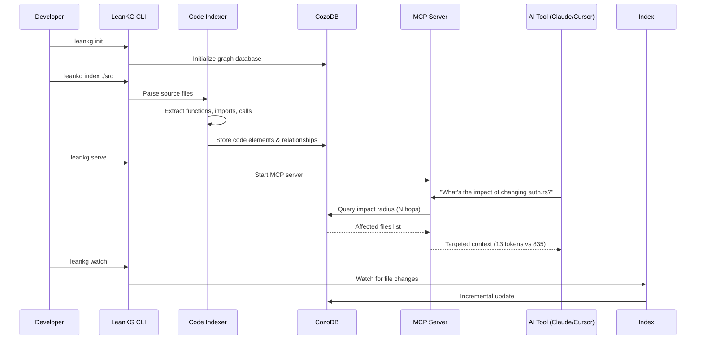
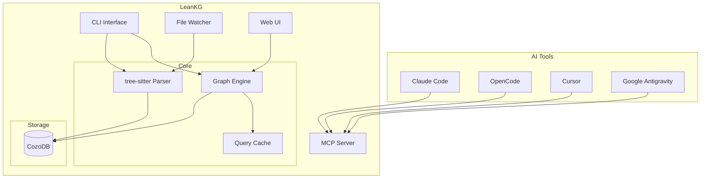

<p align="center">
  
</p>

# LeanKG

[](https://opensource.org/licenses/MIT)
[](https://www.rust-lang.org/)
[](https://crates.io/crates/leankg)
[](https://discord.gg/leankg)

**Lightweight Knowledge Graph for AI-Assisted Development**

LeanKG is a local-first knowledge graph that gives AI coding tools accurate codebase context. It indexes your code, builds dependency graphs, generates documentation, and exposes an MCP server so tools like Cursor, OpenCode, and Claude Code can query the knowledge graph directly. No cloud services, no external databases -- everything runs on your machine with minimal resources.

---

## Token Savings Example (Benchmarked)

Real benchmark results from the [Go API Service example](examples/go-api-service/):

| Scenario | Without LeanKG | With LeanKG | Savings |
|----------|----------------|-------------|---------|
| Impact Analysis | 835 tokens | 13 tokens | **98.4%** |
| Full Feature Testing | 9,601 tokens | 42 tokens | **99.6%** |

```bash
# Run the benchmark yourself
cd examples/go-api-service
python3 benchmark.py
```

**Before LeanKG**: AI must scan entire codebase to understand dependencies (~9,600 tokens)

**After LeanKG**: LeanKG provides targeted subgraph with relationships pre-computed (~42 tokens)

---

## Why LeanKG?

AI coding tools waste tokens scanning entire codebases. LeanKG provides **targeted context** instead:

| Scenario | Without LeanKG | With LeanKG |
|----------|----------------|-------------|
| **File review** | Full content of changed files + diff | Blast radius + structural summary |
| **Impact analysis** | Manually trace dependencies | `get_impact_radius` returns affected files |
| **Token count** | 9,600+ tokens for full scan | 13-42 tokens with graph |

---

## Installation

### One-Line Install (Recommended)

Install the LeanKG binary and configure MCP for your AI coding tool:

```bash
curl -fsSL https://raw.githubusercontent.com/FreePeak/LeanKG/main/scripts/install.sh | bash -s -- <target>
```

**Supported targets:**

| Target | AI Tool | Config Location |
|--------|---------|-----------------|
| `opencode` | OpenCode AI | `~/.config/opencode/opencode.json` |
| `cursor` | Cursor AI | `~/.config/cursor/mcp.json` |
| `claude` | Claude Code/Desktop | `~/.config/claude/settings.json` |
| `gemini` | Gemini CLI | `~/.config/gemini-cli/mcp.json` |
| `antigravity` | Google Antigravity | `~/.gemini/antigravity/mcp_config.json` |

**Examples:**

```bash
# Install for OpenCode
curl -fsSL https://raw.githubusercontent.com/FreePeak/LeanKG/main/scripts/install.sh | bash -s -- opencode

# Install for Cursor
curl -fsSL https://raw.githubusercontent.com/FreePeak/LeanKG/main/scripts/install.sh | bash -s -- cursor

# Install for Claude Code
curl -fsSL https://raw.githubusercontent.com/FreePeak/LeanKG/main/scripts/install.sh | bash -s -- claude

# Install for Gemini CLI
curl -fsSL https://raw.githubusercontent.com/FreePeak/LeanKG/main/scripts/install.sh | bash -s -- gemini

# Install for Google Antigravity
curl -fsSL https://raw.githubusercontent.com/FreePeak/LeanKG/main/scripts/install.sh | bash -s -- antigravity
```

### Install via Cargo

```bash
cargo install leankg
leankg --version
```

### Build from Source

```bash
git clone https://github.com/your-org/LeanKG.git
cd LeanKG
cargo build --release
```

---

## Quick Start

```bash
# 1. Initialize LeanKG in your project
leankg init

# 2. Index your codebase
leankg index ./src

# 3. Start the MCP server (for AI tools)
leankg serve

# 4. Compute impact radius for a file
leankg impact src/main.rs --depth 3

# 5. Check index status
leankg status
```

---

## How It Works



1. **Index** -- LeanKG parses your codebase and builds a graph of code elements (functions, classes, modules) and their relationships (imports, calls, tests).
2. **Query** -- AI tools query the graph via MCP instead of scanning files.
3. **Optimize** -- Get targeted context with ~99% token reduction.

---

## MCP Server Setup

LeanKG exposes a Model Context Protocol (MCP) server that AI tools can connect to.

### Automated Setup (Recommended)

Use the install script to install and configure MCP for your AI tool:

```bash
curl -fsSL https://raw.githubusercontent.com/FreePeak/LeanKG/main/scripts/install.sh | bash -s -- <target>
```

### Manual Setup

#### OpenCode AI

Add to `~/.config/opencode/opencode.json`:

```json
{
  "mcp": {
    "leankg_dev": {
      "type": "local",
      "command": ["leanKG", "mcp-stdio", "--watch"],
      "enabled": true
    }
  }
}
```

#### Cursor AI

Add to `~/.config/cursor/mcp.json`:

```json
{
  "mcpServers": {
    "leankg": {
      "command": "leanKG",
      "args": ["mcp-stdio", "--watch"]
    }
  }
}
```

#### Claude Code / Claude Desktop

Add to `~/.config/claude/settings.json`:

```json
{
  "mcpServers": {
    "leankg": {
      "command": "leanKG",
      "args": ["mcp-stdio", "--watch"]
    }
  }
}
```

#### Gemini CLI

Add to `~/.config/gemini-cli/mcp.json`:

```json
{
  "mcpServers": {
    "leankg": {
      "command": "leanKG",
      "args": ["mcp-stdio", "--watch"]
    }
  }
}
```

#### Google Antigravity

Add to `~/.gemini/antigravity/mcp_config.json`:

```json
{
  "servers": {
    "leankg": {
      "command": "leanKG",
      "args": ["mcp-stdio", "--watch"]
    }
  }
}
```

### Starting the MCP Server

```bash
# Stdio mode with auto-indexing (for local AI tools)
leanKG mcp-stdio --watch

# Stdio mode without auto-indexing
leanKG mcp-stdio
```

---

## Agentic Instructions for AI Tools

LeanKG can instruct AI coding agents to use it **first** before falling back to naive search. See [Agentic Instructions](docs/agentic-instructions.md) for setup and usage.

---

## Highlights

- **Code Indexing** -- Parse and index Go, TypeScript, Python, and Rust codebases with tree-sitter.
- **Dependency Graph** -- Build call graphs with `IMPORTS`, `CALLS`, and `TESTED_BY` edges.
- **Impact Radius** -- Compute blast radius for any file to see downstream impact.
- **Auto Documentation** -- Generate markdown docs from code structure automatically.
- **MCP Server** -- Expose the graph via MCP protocol for AI tool integration.
- **File Watching** -- Watch for changes and incrementally update the index.
- **CLI** -- Single binary with init, index, serve, impact, and status commands.
- **Business Logic Mapping** -- Annotate code elements with business logic descriptions and link to features.
- **Traceability** -- Show feature-to-code and requirement-to-code traceability chains.
- **Documentation Mapping** -- Index docs/ directory, map doc references to code elements.

---

## Auto-Indexing

LeanKG watches your codebase and automatically keeps the knowledge graph up-to-date. See [CLI Reference](docs/cli-reference.md#auto-indexing) for detailed commands.

---

## Architecture



---

## CLI Commands

For the complete CLI reference, see [CLI Reference](docs/cli-reference.md).

---

## MCP Tools

| Tool | Description |
|------|-------------|
| `mcp_init` | Initialize LeanKG project (creates .leankg/, leankg.yaml) |
| `mcp_index` | Index codebase (path, incremental, lang, exclude options) |
| `mcp_install` | Create .mcp.json for MCP client configuration |
| `mcp_status` | Show index statistics and status |
| `mcp_impact` | Calculate blast radius for a file |
| `query_file` | Find file by name or pattern |
| `get_dependencies` | Get file dependencies (direct imports) |
| `get_dependents` | Get files depending on target |
| `get_impact_radius` | Get all files affected by change within N hops |
| `get_review_context` | Generate focused subgraph + structured review prompt |
| `get_context` | Get AI context for file (minimal, token-optimized) |
| `find_function` | Locate function definition |
| `get_call_graph` | Get function call chain (full depth) |
| `search_code` | Search code elements by name/type |
| `generate_doc` | Generate documentation for file |
| `find_large_functions` | Find oversized functions by line count |
| `get_tested_by` | Get test coverage for a function/file |
| `get_doc_for_file` | Get documentation files referencing a code element |
| `get_files_for_doc` | Get code elements referenced in a documentation file |
| `get_doc_structure` | Get documentation directory structure |
| `get_traceability` | Get full traceability chain for a code element |
| `search_by_requirement` | Find code elements related to a requirement |
| `get_doc_tree` | Get documentation tree structure |
| `get_code_tree` | Get codebase structure |
| `find_related_docs` | Find documentation related to a code change |

**Auto-Initialization:** When the MCP server starts without an existing LeanKG project, it automatically initializes and indexes the current directory. This provides a "plug and play" experience for AI tools.

**Auto-Indexing:** When the MCP server starts with an existing LeanKG project, it checks if the index is stale (by comparing git HEAD commit time vs database file modification time). If stale, it automatically runs incremental indexing to ensure AI tools have up-to-date context.

---

## Supported AI Tools

| Tool | Integration | Status |
|------|-------------|--------|
| **Claude Code** | MCP | Supported |
| **OpenCode** | MCP | Supported |
| **Cursor** | MCP | Supported |
| **Google Antigravity** | MCP | Supported |
| **Windsurf** | MCP | Supported |
| **Codex** | MCP | Supported |

---

## Roadmap

### Phase 2 -- Pipeline Integration

| Feature | Status | Description |
|---------|--------|-------------|
| **Pipeline Parsing** | Planned | Parse CI/CD config files (GitHub Actions, GitLab CI, Jenkins, Azure) |
| **Pipeline Graph** | Planned | Build pipeline, stage, step nodes |
| **Trigger Links** | Planned | Link source file changes to triggered pipelines |
| **Pipeline Impact** | Planned | Include pipelines in blast radius analysis |
| **Deployment Targets** | Planned | Track which stages deploy to which environments |

**Supported CI/CD Platforms (Coming Soon):**
- GitHub Actions (`.github/workflows/*.yml`)
- GitLab CI (`.gitlab-ci.yml`)
- Jenkins (`Jenkinsfile`)
- Azure Pipelines (`azure-pipelines.yml`)

### Future Features

| Feature | Description |
|---------|-------------|
| **Semantic Search** | AI-powered code search using embeddings |
| **Security Analysis** | Detect vulnerable dependencies and patterns |
| **Cost Estimation** | Cloud resource cost tracking via pipeline data |
| **Multi-Project** | Index and query across multiple repositories |

---

## Requirements

**For npm installation (recommended):**
- Node.js 18+
- npm 8+

**For building from source:**
- Rust 1.70+
- macOS or Linux

---

## Tech Stack

| Component | Technology |
|-----------|------------|
| Language | Rust |
| Database | CozoDB (embedded relational-graph, Datalog queries) |
| Parsing | tree-sitter |
| CLI | Clap |
| Web Server | Axum |
| Installer | Node.js (npm package for binary distribution) |

---

## Project Structure

```
src/
  cli/         - CLI commands (Clap)
  config/      - Project configuration
  db/          - CozoDB persistence layer
  doc/         - Documentation generator
  graph/       - Graph query engine
  indexer/     - Code parser (tree-sitter)
  doc_indexer/ - Documentation indexer
  mcp/         - MCP protocol handler
  watcher/     - File change watcher
  web/         - Web server (Axum)

docs/
  planning/    - Planning documents
  requirement/ - Requirements documents (PRD)
  analysis/    - Analysis documents
  design/      - Design documents (HLD)
  business/    - Business logic documents
```

---

## License

MIT
