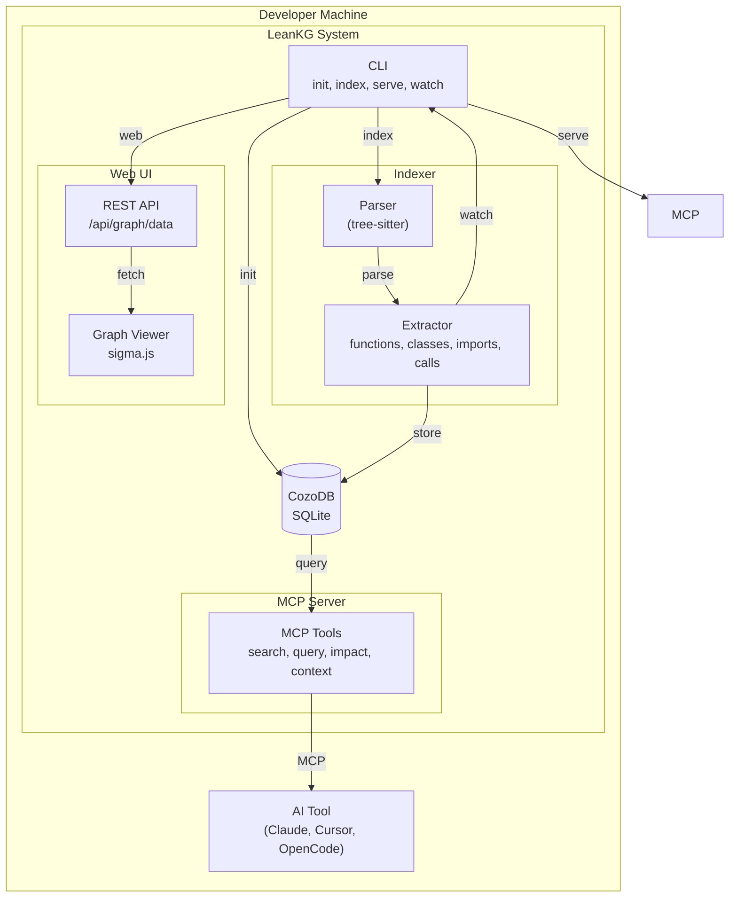
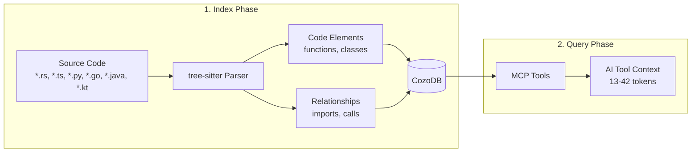

# LeanKG Architecture

## System Design

### C4 Model - Level 2: Component Diagram



### Data Flow



---

## Data Model

### Node Types

| Element Type | Description | Example |
|--------------|-------------|---------|
| `function` | Code functions | `src/auth.rs::validate_token` |
| `class` | Classes and structs | `src/db/models.rs::User` |
| `module` | Files/modules | `src/db/models.rs` |
| `document` | Documentation files | `docs/architecture.md` |
| `doc_section` | Doc headings | `docs/api.md::Usage` |

### Relationship Types

| Type | Direction | Description |
|------|----------|-------------|
| `calls` | A → B | Function A calls function B |
| `imports` | A → B | Module A imports module B |
| `contains` | doc → section | Document contains section |
| `tested_by` | A → B | Code A is tested by test B |
| `documented_by` | A → B | Code A is documented by doc B |

**Key Insight:** The graph stores the FULL dependency graph at indexing time. When you query, LeanKG traverses N hops from your target to find all affected elements - no file scanning needed.

---

## Tech Stack

- **Language:** Rust 1.70+
- **Database:** CozoDB (embedded SQLite)
- **Parser:** tree-sitter
- **MCP Protocol:** Custom implementation
- **Web UI:** Vite + React + TailwindCSS + Sigma.js

### Supported Languages

- Rust
- Go
- TypeScript / JavaScript
- Python
- Java
- Kotlin
- Ruby
- PHP
- Perl
- R
- Elixir

---

## Project Structure

```
src/
├── lib.rs              # Module exports
├── db/
│   └── models.rs       # Data models (CodeElement, Relationship)
├── graph/
│   └── query.rs        # Graph query engine
├── mcp/
│   ├── tools.rs        # MCP tool definitions
│   └── handler.rs      # MCP tool handlers
├── indexer/
│   ├── extractor.rs    # Code parsing with tree-sitter
│   └── watcher.rs      # File watching
└── cli/
    └── mod.rs          # CLI commands
```
