# LeanKG High Level Design

**Phien ban:** 1.6  
**Ngay:** 2026-03-28  
**Dua tren:** PRD v1.7  
**Trang thai:** Ban nhap  
**Changelog:** 
- v1.19 - Auto-Index on DB Write:
  - Add WriteTracker with atomic dirty flag for external CozoDB writes
  - Add TrackingDb wrapper to intercept :put/:delete operations
  - Lazy reindex on MCP tool call when dirty flag is set
  - Config option `auto_index_on_db_write: true` (default true)
- v1.18 - RTK Integration:
  - Add LeanKGCompressor for internal command compression
  - Add CargoTestCompressor with failures-only mode (85%+ savings)
  - Add GitDiffCompressor with stats extraction (70%+ savings)
  - Extend ShellCompressor with leankg-specific patterns
  - RTK A/B test: 54% token reduction on common dev commands
- v1.17 - AB Testing Context Correctness:
  - File path regex validation for improved correctness
  - Enhanced quality metrics output
- v1.15 - Performance Optimizations:
  - Add parallel file parsing using rayon for multi-core indexing
  - Batch relationship inserts (1000 rows/batch) instead of individual inserts
  - Optimize resolve_call_edges: filter at DB level, only process unresolved edges
  - Thread-local parser reuse to avoid re-creating tree-sitter parsers
- v1.14 - Web UI Orphan Node Filtering Fix:
  - Fixed orphan nodes appearing in webui graph view
  - `filterOrphanedNodes` now applies to ALL filter types (all, document, function, mapping), not just 'all'
  - Fixed 'mapping' filter bug where `e.target` was not added to nodeIds
- v1.13 - Terraform and CI/CD YAML Indexing:
  - Add Terraform extractor for .tf files (HCL parsing)
  - Add CI/CD YAML extractor for GitHub Actions, GitLab CI, Azure Pipelines
  - Add terraform and cicd element types
  - Update ParserManager and indexer to handle new file types
- v1.12 - P2 MCP Tool Improvements:
  - Add `required` arrays to all MCP tools for proper schema validation
  - Add `depth` param (default 2) and `max_results` param (default 30) to `get_call_graph`
  - Add `file` optional param to `find_function` for scoping
  - Lower default `limit` for `search_code` from 100 to 20, add `max: 50` cap
  - Add `element_type` filter enum to `search_code` and `query_file`
  - Add warning to `get_impact_radius` description about depth explosion risk
- v1.11 - Depth-limited get_call_graph_bounded
  - Add `get_call_graph_bounded` to prevent neighbor explosion
  - Unroll recursion manually for depth <= 3 with `:limit` clause to cap results
  - Add `depth` and `max_results` parameters to `get_call_graph` MCP tool
- v1.10 - P2 Token Efficiency - signature_only Mode
  - Add `signature_only` mode to `get_context` tool: returns only function signatures (default) instead of full body metadata
  - Add `max_tokens` parameter to cap context size (default: 4000)
  - Update `extract_function` to capture signature in metadata for token-efficient context retrieval
  - Add `find_body_start_line` helper to identify function body start position
- v1.9 - P1 AST Extraction Fixes
  - Fix `is_noise_call` filter: add missing noise calls, change single-char filter from `== 1` to `>= 2`
  - Fix Go `implements` detection: only emit for embedded (anonymous) fields, skip named fields
  - Add `resolve_call_edges` post-index resolution pass to resolve `__unresolved__` prefixed call targets to actual qualified names
- v1.8 - P0 Documentation Indexing Fixes
  - Add `mcp_index_docs` MCP tool to index documentation directory and populate documented_by/references relationships
  - Fix doc regex to match any filename with known source extension (not just `src/`, `lib/`, `./` prefixed)
  - Fix code-block skipping to properly skip content inside triple backtick blocks
  - Fix `parse_doc_file` to extract and store headings in document metadata
- v1.8 - Query Push-down Optimization
  - Add `search_by_name_typed` and `find_elements_by_name_exact` pushed-down predicate queries to GraphEngine
  - Add `run_element_query` helper to deduplicate CodeElement row mapping
  - Update MCP handlers to use pushed-down queries instead of fetching all elements and filtering in Rust
  - Query optimization reduces data transfer between CozoDB and application by filtering at database level
- v1.6 - Auto-Indexing on MCP Server Start
  - Added auto-indexing on startup when index is stale (git-based detection)
  - Added configuration options for auto-indexing behavior
  - Added index staleness detection (git HEAD vs DB file timestamp)
- v1.5 - MCP Server Self-Initialization
  - Added MCP tools mirroring CLI: mcp_init, mcp_index, mcp_install, mcp_status, mcp_impact
  - Added auto-init behavior on MCP server startup
  - MCP server auto-detects uninitialized projects and runs init + index
- v1.4 - Phase 2 Features: Documentation-Structure Mapping, Enhanced Business Logic, Impact Fixes
  - Added Doc Indexer component for indexing docs/ directory
  - Added documentation node types (document, doc_section) to data model
  - Added documentation relationship types (references, documented_by)
  - Added Doc Indexing Flow (Section 3.7)
  - Added Traceability Flow (Section 3.8)
  - Fixed Impact Analysis Flow with qualified name normalization
  - Added new MCP tools for documentation and traceability queries
- v1.3 - Phase 2: Pipeline Information Extraction
  - Added Pipeline Parser component to Code Indexer
  - Added pipeline node types (pipeline, pipeline_stage, pipeline_step) to data model
  - Added pipeline relationship types (triggers, builds, depends_on)
  - Added Pipeline Indexing Flow (Section 3.5)
  - Added Pipeline Impact Analysis Flow (Section 3.6)
  - Added pipeline MCP tools and CLI commands
  - Updated C4 diagrams to include pipeline components
- v1.2.1 - Migrated database from SurrealDB to CozoDB (embedded SQLite-backed relational-graph with Datalog queries)
- v1.2 - Tech stack: Rust + SurrealDB
- v1.1 - Added impact radius analysis, TESTED_BY edges, review context, qualified names, auto-install MCP, per-project DB

---

## 1. Tổng quan kiến trúc

### 1.1 Design Principles

| Principle | Mô tả |
|-----------|-------|
| **Local-first** | Tất cả data và xử lý đều chạy local, không phụ thuộc cloud |
| **Single binary** | Ứng dụng được pack thành một file binary duy nhất |
| **Minimal dependencies** | Không yêu cầu external services như database processes |
| **Incremental** | Chỉ xử lý thay đổi, không scan lại toàn bộ |
| **MCP-native** | Thiết kế từ đầu cho MCP protocol |

### 1.2 System Overview

LeanKG là một local-first knowledge graph system cung cấp codebase intelligence cho AI coding tools. Hệ thống parse code, build dependency graph, và expose interface qua CLI và MCP server.

---

## 2. C4 Models

### 2.1 Context Diagram (C4-1)

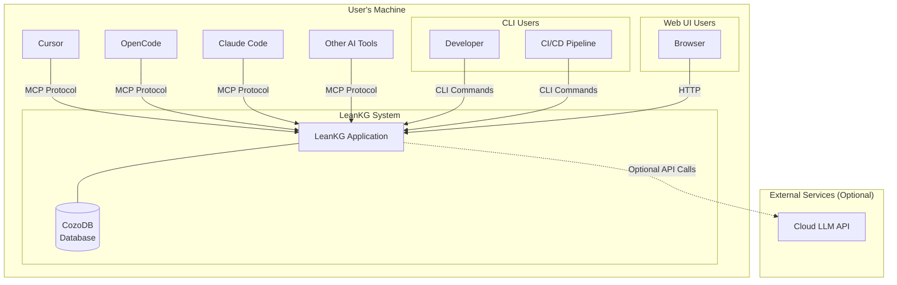

**Mô tả:**
- **LeanKG System:** Hệ thống chính chạy trên máy người dùng
- **AI Tools:** Cursor, OpenCode, Claude Code và các AI coding tools khác tương tác qua MCP protocol
- **Developer:** Sử dụng CLI để index, query, và generate documentation
- **CI/CD Pipeline:** Tự động hóa indexing trong quá trình build
- **Browser:** Truy cập lightweight web UI
- **Cloud LLM API:** Optional - cho future semantic search features

### 2.2 Container Diagram (C4-2)

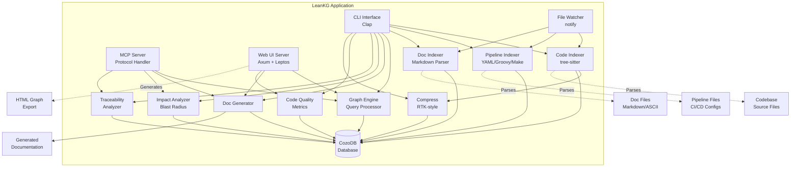

**Containers:**

| Container | Responsibility | Technology |
|-----------|---------------|------------|
| CLI Interface | Command-line interaction | Clap (Rust) |
| MCP Server | MCP protocol communication | Custom Rust implementation |
| Web UI Server | HTTP server for UI | Axum + Leptos (Rust) |
| Code Indexer | Parse source code with tree-sitter | tree-sitter (Rust) |
| Pipeline Indexer | Parse CI/CD configuration files | YAML/Groovy/Makefile parsers (Rust) |
| Doc Indexer | Parse documentation files and extract code references | Markdown parser (Rust) |
| Graph Engine | Query and traverse knowledge graph | Rust |
| Doc Generator | Generate markdown documentation | Rust templates |
| File Watcher | Monitor file changes | notify (Rust) |
| Impact Analyzer | Calculate blast radius / impact radius | Rust (BFS traversal) |
| Traceability Analyzer | Trace requirements to code via documentation | Rust |
| Code Quality | Detect large functions, code metrics | Rust |
| Compress | Token compression for CLI output, RTK-style filtering | Rust |
| CozoDB | Persistent storage (per-project) | CozoDB (embedded SQLite-backed) |
| NPM Installer | Download and install pre-built binaries | Node.js (npm package) |

**Interactions:**

1. **CLI -> Indexer:** Developer chay lenh index
2. **CLI -> PipeIdx:** Developer chay lenh index (pipeline files auto-detected)
3. **CLI -> Graph:** Developer query knowledge graph
4. **CLI -> DocGen:** Developer generate documentation
5. **CLI -> Impact:** Developer calculate blast radius (includes pipeline impact)
6. **CLI -> Qual:** Developer check code quality metrics
7. **MCP -> Graph:** AI tools query code relationships
8. **MCP -> DocGen:** AI tools retrieve context
9. **MCP -> Impact:** AI tools calculate impact for changes (includes pipeline impact)
10. **Web -> Graph:** User browse graph trong browser
11. **Web -> Qual:** User view code quality metrics
12. **Indexer -> DB:** Store parsed code elements
13. **PipeIdx -> DB:** Store parsed pipeline elements and relationships
14. **Watcher -> Indexer:** Trigger re-index khi source files thay doi
15. **Watcher -> PipeIdx:** Trigger re-index khi pipeline files thay doi
16. **Web -> HTML:** Generate self-contained HTML graph export

### 2.3 Component Diagram (C4-3)

```mermaid
graph TB
    subgraph "Code Indexer"
        Parser[Parser Manager]
        GoParser[Go Parser]
        TSParser[TS/JS Parser]
        PyParser[Python Parser]
        Extractor[Entity Extractor]
        Builder[Graph Builder]
        
        Parser --> GoParser
        Parser --> TSParser
        Parser --> PyParser
        
        GoParser --> Extractor
        TSParser --> Extractor
        PyParser --> Extractor
        
        Extractor --> Builder
    end
    
    subgraph "Pipeline Indexer"
        PipeDetect[Pipeline Detector]
        GHAParser[GitHub Actions Parser]
        GLParser[GitLab CI Parser]
        JenkinsParser[Jenkinsfile Parser]
        MakeParser[Makefile Parser]
        DockerParser[Dockerfile Parser]
        PipeExtract[Pipeline Extractor]
        PipeBuilder[Pipeline Graph Builder]
        
        PipeDetect --> GHAParser
        PipeDetect --> GLParser
        PipeDetect --> JenkinsParser
        PipeDetect --> MakeParser
        PipeDetect --> DockerParser
        
        GHAParser --> PipeExtract
        GLParser --> PipeExtract
        JenkinsParser --> PipeExtract
        MakeParser --> PipeExtract
        DockerParser --> PipeExtract
        
        PipeExtract --> PipeBuilder
    end
    
    subgraph "Doc Indexer"
        DocDetect[Doc Directory Detector]
        MarkdownParser[Markdown Parser]
        CodeRefExtract[Code Reference<br/>Extractor]
        DocBuilder[Doc Graph Builder]
        TraceLink[Traceability<br/>Linker]
        
        DocDetect --> MarkdownParser
        MarkdownParser --> CodeRefExtract
        CodeRefExtract --> DocBuilder
        DocBuilder --> TraceLink
    end
    
    subgraph "Graph Engine"
        Query[Query Processor]
        Search[Search Engine]
        Relate[Relationship Engine]
        Cache[Query Cache]
        
        Query --> Search
        Query --> Relate
        Search --> Cache
        Relate --> Cache
    end
    
    subgraph "Impact Analyzer"
        BFS[BFS Traversal]
        QualNorm[Qualified Name<br/>Normalizer]
        Radius[Radius Calculator]
        Context[Review Context<br/>Generator]
        PipeImpact[Pipeline Impact<br/>Calculator]
        ImpactCache[Impact Cache]
        
        BFS --> QualNorm
        QualNorm --> Radius
        Radius --> Context
        Radius --> PipeImpact
        Radius --> ImpactCache
    end
    
    subgraph "Code Quality"
        Metrics[Metrics Collector]
        LargeFunc[Large Function<br/>Detector]
        Fanout[High Fan-out<br/>Detector]
        
        Metrics --> LargeFunc
        Metrics --> Fanout
    end
    
    subgraph "Doc Generator"
        Template[Template Engine]
        Renderer[Markdown Renderer]
        Format[Formatter]
        Sync[Doc Sync Manager]
        
        Template --> Renderer
        Renderer --> Format
        Format --> Sync
    end
    
    subgraph "MCP Server"
        Protocol[MCP Protocol]
        Handler[Request Handler]
        Tools[Tool Registry]
        Auth[Auth Manager]
        Install[MCP Config<br/>Installer]
        
        Protocol --> Handler
        Handler --> Tools
        Handler --> Auth
        Handler --> Install
    end
    
    Builder -->|Writes| DB[(CozoDB)]
    PipeBuilder -->|Writes| DB
    Query -.->|Reads| DB
    Sync -.->|Reads| DB
    Tools -.->|Queries| Graph
    BFS -.->|Reads| DB
    Context -.->|Reads| DB
    PipeImpact -.->|Reads| DB
    Metrics -.->|Reads| DB
```

**Components:**

| Component | Responsibility |
|-----------|----------------|
| Parser Manager | Language detection va parser delegation |
| Go Parser | Parse Go source files |
| TS/JS Parser | Parse TypeScript/JavaScript files |
| Python Parser | Parse Python files |
| Ruby Parser | Parse Ruby files |
| PHP Parser | Parse PHP files |
| Perl Parser | Parse Perl files |
| R Parser | Parse R files |
| Elixir Parser | Parse Elixir files |
| Entity Extractor | Extract functions, classes, imports, TESTED_BY |
| Graph Builder | Build relationships va store to DB |
| Pipeline Detector | Auto-detect CI/CD config files by path and naming convention |
| GitHub Actions Parser | Parse `.github/workflows/*.yml` files |
| GitLab CI Parser | Parse `.gitlab-ci.yml` files |
| Jenkinsfile Parser | Parse Jenkinsfile (declarative/scripted) |
| Makefile Parser | Parse Makefile targets and dependencies |
| Dockerfile Parser | Parse Dockerfile and docker-compose.yml |
| Pipeline Extractor | Extract pipeline stages, steps, triggers, artifacts from parsed AST |
| Pipeline Graph Builder | Build pipeline nodes and relationships (triggers, builds, depends_on) |
| Doc Directory Detector | Auto-detect docs/ subdirectories (planning, requirement, analysis, design, business, api, ops) |
| Markdown Parser | Parse markdown files and extract structure |
| Code Reference Extractor | Extract code element references from documentation |
| Doc Graph Builder | Build document nodes and references/documents relationships |
| Traceability Linker | Link business logic annotations to documentation |
| Query Processor | Process user queries |
| Search Engine | Search code elements |
| Relationship Engine | Traverse graph relationships |
| Query Cache | Cache frequent queries |
| Call Edge Resolver | Resolve `__unresolved__` prefixed call targets to actual qualified names post-indexing |
| BFS Traversal | Breadth-first search for blast radius |
| Qualified Name Normalizer | Normalize function names to qualified names for accurate matching |
| Radius Calculator | Calculate impact radius in N hops |
| Review Context Generator | Generate focused subgraph + prompt |
| Pipeline Impact Calculator | Extend blast radius to include affected pipelines and deployment targets |
| Impact Cache | Cache impact radius calculations |
| Metrics Collector | Collect code quality metrics |
| Large Function Detector | Find oversized functions |
| High Fan-out Detector | Find functions with many dependencies |
| Template Engine | Load documentation templates |
| Markdown Renderer | Render markdown output |
| Formatter | Format documentation |
| Doc Sync Manager | Sync docs voi code changes |
| MCP Protocol | Handle MCP protocol messages |
| Request Handler | Route requests to appropriate tools |
| Tool Registry | Register available MCP tools |
| Auth Manager | Authenticate MCP connections |
| MCP Config Installer | Auto-generate .mcp.json for AI tools |

### 2.4 Deployment Diagram (C4-4)

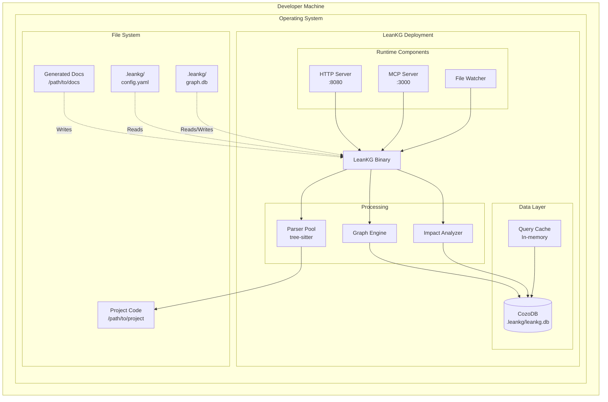

**Deployment Scenarios:**

| Scenario | Environment | Resources |
|----------|--------------|------------|
| macOS Intel | macOS x64 | < 100MB RAM, < 200MB disk |
| macOS Apple Silicon | macOS ARM64 | < 100MB RAM, < 200MB disk |
| Linux x64 | Linux x64 | < 100MB RAM, < 200MB disk |
| Linux ARM64 | Linux ARM64 | < 100MB RAM, < 200MB disk |

**Database Location:** Per-project at `.leankg/leankg.db` (gitignored, portable with project)

**Processes:**

| Process | Port | Description |
|---------|------|-------------|
| LeanKG Binary | - | Main application process |
| HTTP Server | 8080 | Web UI server (optional) |
| MCP Server | 3000 | MCP protocol endpoint |
| File Watcher | - | Background notify process |
| CozoDB | - | Embedded SQLite-backed database |

---

## 3. Data Flow

### 3.1 Indexing Flow

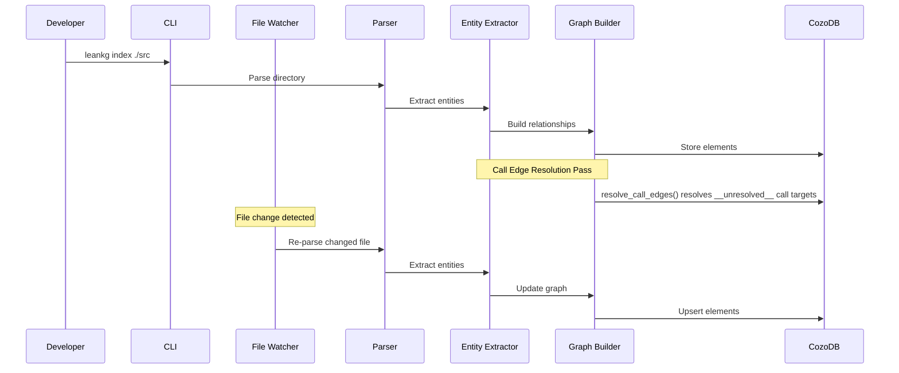

#### Call Edge Resolution

The `extract_call` function in the Entity Extractor creates call edges with `__unresolved__` prefixed target qualified names (e.g., `__unresolved__foo`) because it cannot know the full path at extraction time. After all files are indexed, `resolve_call_edges()` is called as a post-index resolution pass to resolve these placeholders:

1. Query all relationships with `target_qualified` starting with `__unresolved__`
2. Extract the bare callee name from the placeholder
3. Look up the function by bare name in the same file (preferred) or any file
4. Replace the unresolved placeholder with the actual qualified name
5. Delete the unresolved relationship and insert the resolved one

The resolution query uses the `callee_file_hint` stored in metadata to prefer functions in the same file first.

### 3.2 Query Flow

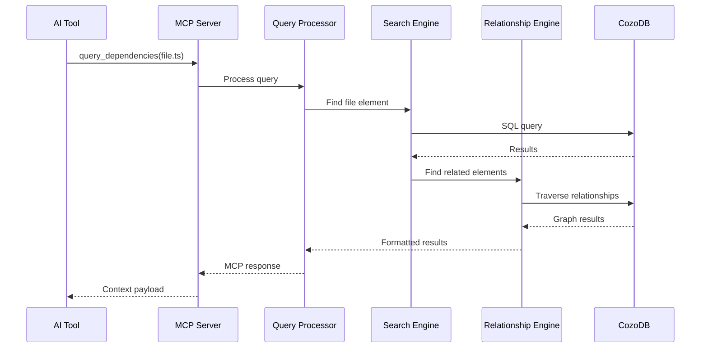

### 3.3 Documentation Generation Flow

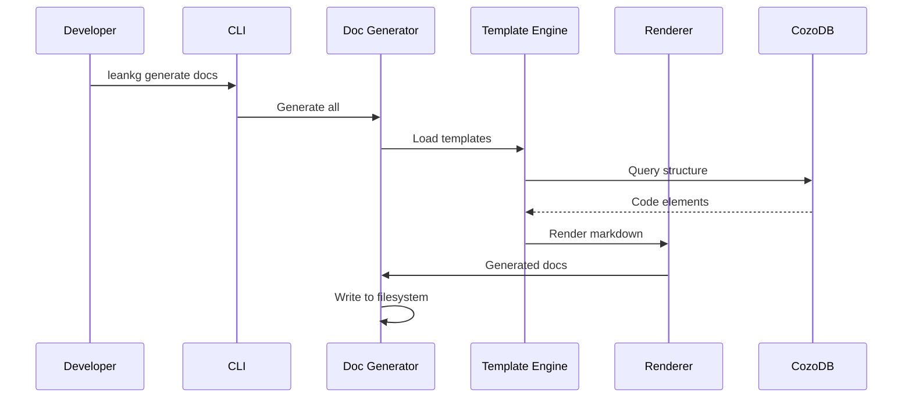

### 3.4 Impact Analysis Flow

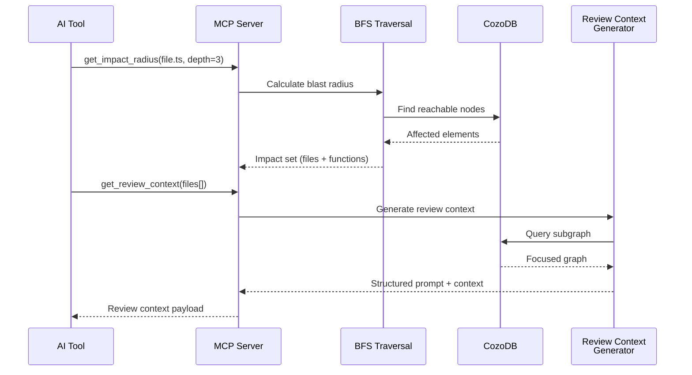

### 3.5 Pipeline Indexing Flow (Phase 2)

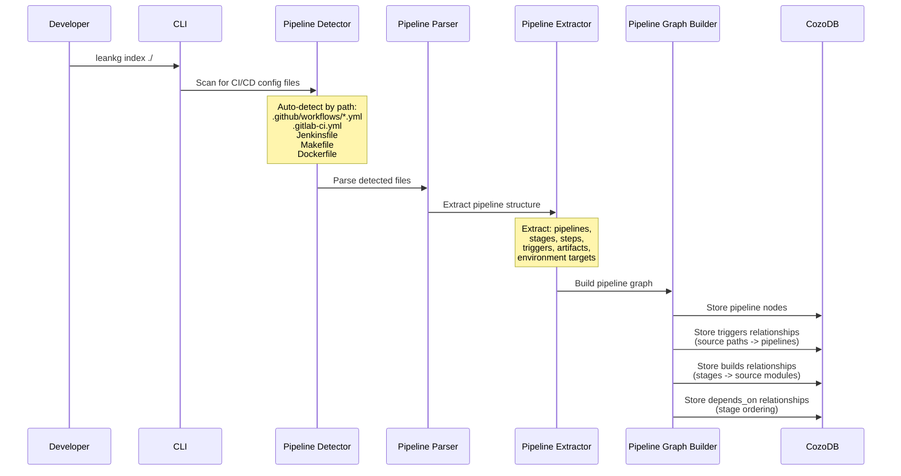

### 3.6 Pipeline Impact Analysis Flow (Phase 2)

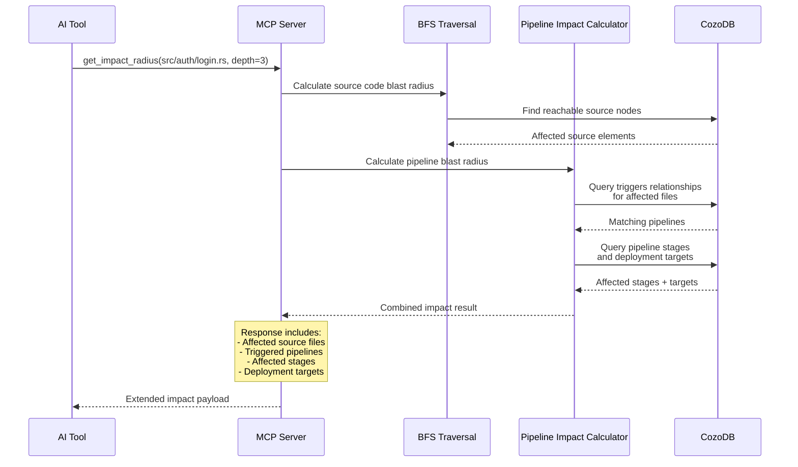

### 3.7 Doc Indexing Flow (Phase 2)

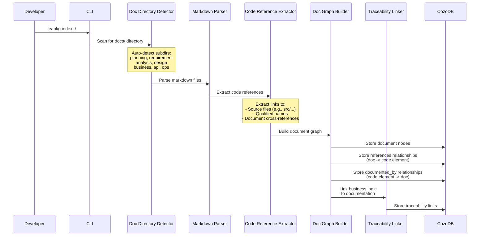

### 3.8 Traceability Flow (Phase 2)

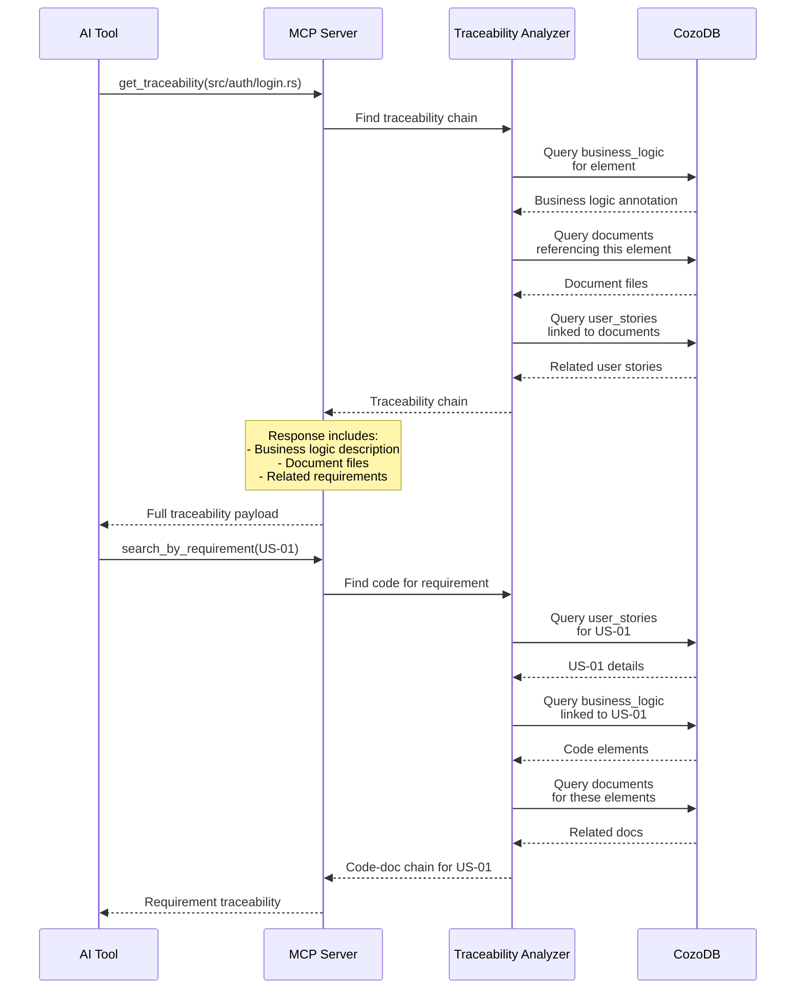

---

## 4. Data Model

### 4.1 Entity Relationship Diagram

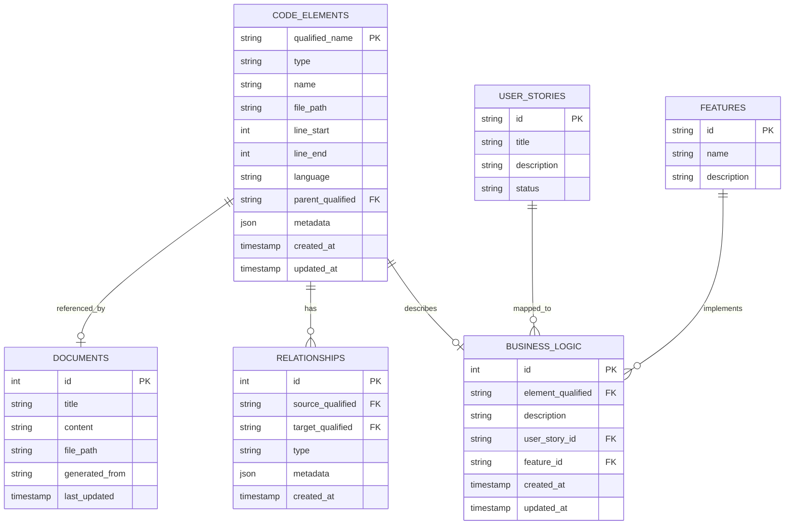

### 4.2 Schema Description

| Table | Mo ta |
|-------|-------|
| CODE_ELEMENTS | Luu tru tat ca code elements (files, functions, classes, imports, exports) va pipeline elements (pipelines, stages, steps). PK = qualified_name (`file_path::parent::name`) |
| RELATIONSHIPS | Quan he giua cac elements: source code (imports, calls, implements, contains, tested_by) va pipeline (triggers, builds, depends_on) |
| BUSINESS_LOGIC | Annotations mo ta business logic cua tung element |
| DOCUMENTS | Generated documentation files |
| USER_STORIES | User stories duoc map voi code |
| FEATURES | Features duoc map voi code |

### 4.3 Documentation-Specific Node Types (Phase 2)

| Element Type | qualified_name Format | Description | Metadata Fields |
|-------------|----------------------|-------------|-----------------|
| `document` | `docs/path/to/file.md` | A documentation file | `{title, category, headings[], line_count}` |
| `doc_section` | `docs/path/to/file.md::section_name` | A section within a document | `{level, line_start, line_end}` |

**Category mapping:**
- `docs/planning/` -> category: "planning"
- `docs/requirement/` -> category: "requirement"
- `docs/analysis/` -> category: "analysis"
- `docs/design/` -> category: "design"
- `docs/business/` -> category: "business"
- `docs/api/` -> category: "api"
- `docs/ops/` -> category: "ops"
- Custom directories -> category: from directory name

### 4.4 Pipeline-Specific Node Types (Phase 2)

| Element Type | qualified_name Format | Description | Metadata Fields |
|-------------|----------------------|-------------|-----------------|
| `pipeline` | `file_path::pipeline_name` | A CI/CD workflow/pipeline definition | `{ci_platform, trigger_events, branches}` |
| `pipeline_stage` | `file_path::pipeline_name::stage_name` | A stage/job within a pipeline | `{runner, environment, condition, timeout}` |
| `pipeline_step` | `file_path::pipeline_name::stage_name::step_name` | An individual step within a stage | `{command, image, artifact_paths}` |

### 4.4 Documentation-Specific Relationship Types (Phase 2)

| Relationship | Source | Target | Description | Metadata |
|-------------|--------|--------|-------------|----------|
| `references` | `document` | `code_element` | Documentation references a code element | `{context, line_number}` |
| `documented_by` | `code_element` | `document` | Code element is documented by this doc | `{context}` |
| `contains` | `document` | `document` | Parent document contains child (heading hierarchy) | `{heading_level}` |
| `linked_to_requirement` | `document` | `user_story` | Document linked to a requirement | `{requirement_id}` |
| `implements` | `code_element` | `user_story` | Code element implements a requirement | `{user_story_id}` |

### 4.5 Pipeline-Specific Relationship Types (Phase 2)

| Relationship | Source | Target | Description | Metadata |
|-------------|--------|--------|-------------|----------|
| `triggers` | `file` (source path pattern) | `pipeline` | Source file changes trigger this pipeline | `{event_type, branch_filter, path_filter}` |
| `builds` | `pipeline_stage` | `file` (source module) | Pipeline stage builds/tests this module | `{build_command, test_command}` |
| `depends_on` | `pipeline_stage` | `pipeline_stage` | Stage execution ordering | `{condition, artifact_dependency}` |
| `deploys_to` | `pipeline_stage` | (environment name in metadata) | Stage deploys to an environment | `{environment, strategy, region}` |

### 4.6 Terraform-Specific Node Types (v1.13)

| Element Type | qualified_name Format | Description | Metadata Fields |
|-------------|----------------------|-------------|-----------------|
| `terraform` | `path/to/file.tf` | A Terraform configuration file | `{provider_count, resource_count}` |
| `terraform_resource` | `path/to/file.tf::resource_type.name` | A Terraform resource block | `{resource_type, name}` |
| `terraform_data` | `path/to/file.tf::data_type.name` | A Terraform data source | `{data_type, name}` |
| `terraform_variable` | `path/to/file.tf::var.name` | A Terraform variable | `{name, type, default}` |
| `terraform_output` | `path/to/file.tf::output.name` | A Terraform output | `{name, value}` |
| `terraform_module` | `path/to/file.tf::module.name` | A Terraform module block | `{name, source}` |

### 4.7 CI/CD YAML-Specific Node Types (v1.13)

| Element Type | qualified_name Format | Description | Metadata Fields |
|-------------|----------------------|-------------|-----------------|
| `cicd` | `path/to/ci.yml` | A CI/CD pipeline YAML file | `{ci_platform, trigger_events}` |
| `cicd_job` | `path/to/ci.yml::job_name` | A CI/CD job/stage | `{name, runner, stage}` |
| `cicd_step` | `path/to/ci.yml::job_name::step_name` | A CI/CD step within a job | `{name, command, image}` |

---

## 5. Interface Specifications

### 5.1 CLI Commands

| Command | Description |
|---------|-------------|
| `leankg init` | Initialize new LeanKG project in .leankg/ |
| `leankg index [path]` | Index codebase and documentation |
| `leankg query <query>` | Query knowledge graph |
| `leankg generate docs` | Generate documentation |
| `leankg annotate` | Add business logic annotations |
| `leankg serve` | Start MCP server và/hoặc web UI |
| `leankg status` | Show index status |
| `leankg watch` | Start file watcher |
| `leankg impact <file> [depth]` | Calculate blast radius for file |
| `leankg install` | Auto-generate MCP config for AI tools |
| `leankg export` | Export graph as self-contained HTML |
| `leankg quality` | Show code quality metrics (large functions) |
| `leankg pipeline [file]` | Show pipelines affected by a file change (Phase 2) |
| `leankg pipeline --list` | List all indexed pipelines and their stages (Phase 2) |
| `leankg docs --tree` | Show documentation directory structure (Phase 2) |
| `leankg docs --for <file>` | Show docs referencing a code file (Phase 2) |
| `leankg docs --link <doc> <element>` | Link documentation to code element (Phase 2) |
| `leankg trace <element>` | Show traceability chain for element (Phase 2) |
| `leankg trace --requirement <id>` | Trace code for a requirement (Phase 2) |

### 5.2 MCP Tools

| Tool | Description |
|------|-------------|
| `mcp_init` | Initialize LeanKG project (creates .leankg/, leankg.yaml) |
| `mcp_index` | Index codebase (path, incremental, lang, exclude options) |
| `mcp_index_docs` | Index documentation directory to create code-doc traceability edges |
| `mcp_install` | Create .mcp.json for MCP client configuration |
| `mcp_status` | Show index statistics and status |
| `mcp_impact` | Calculate blast radius for a file |
| `query_file` | Find file by name or pattern |
| `get_dependencies` | Get file dependencies (direct imports) |
| `get_dependents` | Get files depending on target |
| `get_impact_radius` | Get all files affected by change within N hops |
| `get_review_context` | Generate focused subgraph + structured review prompt |
| `find_function` | Locate function definition |
| `get_call_graph` | Get function call chain with bounded depth and result limit |
| `search_code` | Search code elements by name/type |
| `get_context` | Get AI context for file (minimal, token-optimized) |
| `generate_doc` | Generate documentation for file |
| `find_large_functions` | Find oversized functions by line count |
| `get_tested_by` | Get test coverage for a function/file |
| `get_pipeline_for_file` | Get pipelines triggered by changes to a file (Phase 2) |
| `get_pipeline_stages` | List all stages/jobs in a pipeline with their steps (Phase 2) |
| `get_deployment_targets` | Get environments/targets a file change can reach (Phase 2) |
| `get_doc_for_file` | Get documentation files that reference a code element (Phase 2) |
| `get_files_for_doc` | Get code elements referenced in a documentation file (Phase 2) |
| `get_doc_structure` | Get documentation directory structure (Phase 2) |
| `get_traceability` | Get full traceability chain for a code element (Phase 2) |
| `search_by_requirement` | Find code elements related to a specific requirement (Phase 2) |
| `get_doc_tree` | Get documentation tree structure with hierarchy (Phase 2) |
| `get_doc_content` | Get specific documentation content (Phase 2) |
| `get_code_tree` | Get codebase structure (Phase 2) |
| `find_related_docs` | Find documentation related to a code change (Phase 2) |

**Auto-Initialization Behavior:**
When the MCP server starts via `mcp-stdio` and detects no `.leankg/` or `leankg.yaml` exists in the working directory, it automatically:
1. Runs init (creates .leankg/ and leankg.yaml)
2. Runs index on the current directory (indexes source code)
3. Serves normally

This provides a "plug and play" experience where AI tools can use LeanKG immediately after connecting.

**Auto-Indexing on Startup:**
When the MCP server starts with an existing LeanKG project:
1. Checks if index is stale by comparing git HEAD commit time vs database file modification time
2. If git has newer commits than the database, runs incremental indexing automatically
3. This ensures AI tools always have up-to-date context without manual re-indexing
4. Staleness check can be configured via `mcp.auto_index_on_start` and `mcp.auto_index_threshold_minutes`

**Auto-Indexing on DB Write:**
When external agents write directly to CozoDB (via SQL insert/update/delete), LeanKG automatically detects and triggers reindexing:

1. **Write Tracker** - In-memory `Arc<AtomicBool>` dirty flag + `Arc<RwLock<Instant>>` last_write_time
2. **TrackingDb Wrapper** - Wraps `CozoDb` to intercept `:put` and `:delete` operations
3. **Lazy Reindex** - On any MCP tool call, checks dirty flag; if set, triggers incremental reindex before execution
4. **Config Option** - `mcp.auto_index_on_db_write: true` (default: true)

**Flow:**
```
External Agent writes to CozoDB → TrackingDb sets dirty flag → MCP tool call → detects dirty → triggers incremental reindex → clears dirty flag
```

**Why not file polling or DB triggers:**
- File polling: wastes CPU, ~5s latency from polling interval
- DB triggers: CozoSQLite doesn't support triggers reliably
- Write Tracker: zero-latency detection at write time, deferred reindex only when needed

### 5.3 Web UI Routes

| Route | Description |
|-------|-------------|
| `/` | Main dashboard |
| `/graph` | Interactive graph visualization |
| `/browse` | Code browser |
| `/docs` | Documentation viewer |
| `/annotate` | Business logic annotation |
| `/quality` | Code quality metrics |
| `/export` | Generate self-contained HTML graph |
| `/settings` | Configuration |

---

## 6. Security Considerations

### 6.1 Write Tracking Architecture

| Component | Responsibility |
|----------|----------------|
| `WriteTracker` | `Arc<AtomicBool>` dirty flag + `Arc<RwLock<Instant>>` last_write_time |
| `TrackingDb` | Wraps `CozoDb`, intercepts `:put`/`:delete` → sets dirty flag |
| `MCPServer` | On tool call, checks dirty flag → triggers reindex if needed |

**Key design principles:**
- Non-blocking writes: dirty flag is atomic, no locks during write operations
- Lazy reindex: reindex only when MCP tool actually called (not on every write)
- Zero overhead during reads: dirty flag only affects write operations
- Configurable: can disable via `auto_index_on_db_write: false`

### 6.2 Datalog String Escaping

All user-provided strings in Datalog queries MUST be escaped using the `escape_datalog` helper function:

```rust
/// Escape a string value for safe inline Datalog string literals.
/// CozoDB does not yet support parameterized queries, so we must escape manually.
fn escape_datalog(s: &str) -> String {
    s.replace('\\', "\\\\").replace('"', "\\\"")
}
```

This prevents Datalog injection attacks where malicious string values could break out of string literals and modify query structure.

### 6.2 Local Security

| Concern | Mitigation |
|---------|------------|
| Data at rest | Database file stored locally with optional encryption |
| MCP authentication | Local token-based authentication |
| File access | Sandboxed to project directory |

### 6.2 Network Security

| Concern | Mitigation |
|---------|------------|
| HTTP exposure | Bind to localhost only by default |
| MCP exposure | Local socket or localhost binding |
| External APIs | Optional, user-controlled |

---

## 7. Performance Targets

| Operation | Target | Notes |
|-----------|--------|-------|
| Cold start | < 2s | Binary initialization |
| Index speed | > 10K LOC/s | Per language parser |
| Query latency | < 100ms | Graph queries |
| Memory idle | < 100MB | No active operations |
| Memory peak | < 500MB | During indexing |
| Disk footprint | < 50MB/100K LOC | Database size |

---

## 8. Configuration

### 8.1 Project Configuration (leankg.yaml)

```yaml
project:
  name: my-project
  root: ./src
  languages:
    - go
    - typescript
    - python

indexer:
  exclude:
    - "**/node_modules/**"
    - "**/vendor/**"
    - "**/*.test.go"
  include:
    - "*.go"
    - "*.ts"
    - "*.py"

pipeline:
  enabled: true
  auto_detect: true
  formats:
    - github_actions
    - gitlab_ci
    - jenkinsfile
    - makefile
    - dockerfile
  custom_paths: []

mcp:
  enabled: true
  port: 3000
  auth_token: generated
  auto_index_on_start: true
  auto_index_threshold_minutes: 5
  auto_index_on_db_write: true
  index_on_first_call: true

web:
  enabled: true
  port: 8080

documentation:
  output: ./docs
  templates:
    - agents
    - claude
```

---

## 9. Error Handling

### 9.1 Error Categories

| Category | Handling | User Feedback |
|----------|----------|---------------|
| Parse errors | Skip file, log warning | Warning in CLI output |
| Database errors | Retry with backoff | Error message |
| MCP errors | Return error response | MCP error payload |
| File system errors | Graceful degradation | Warning |

### 9.2 Logging

- **Level:** Configurable (debug, info, warn, error)
- **Output:** STDERR by default, file option available
- **Format:** Structured JSON for machine parsing, text for human

---

## 10. Future Considerations

### 10.1 Phase 2 Features

- Pipeline information extraction (US-09)
  - Pipeline Detector: auto-detect CI/CD config files by path convention
  - Pipeline Parsers: GitHub Actions (YAML), GitLab CI (YAML), Jenkinsfile (Groovy), Makefile, Dockerfile
  - Pipeline Graph Builder: create pipeline/stage/step nodes and triggers/builds/depends_on edges
  - Pipeline Impact Calculator: extend blast radius to include pipeline and deployment targets
  - Pipeline MCP tools: get_pipeline_for_file, get_pipeline_stages, get_deployment_targets
  - Pipeline CLI commands: leankg pipeline
  - Pipeline context in auto-generated docs
- Documentation-structure mapping (US-10)
  - Doc Directory Detector: auto-detect docs/ subdirectories
  - Markdown Parser: parse markdown and extract structure
  - Code Reference Extractor: find code element references in docs
  - Doc Graph Builder: create document nodes and references relationships
  - Doc MCP tools: get_doc_for_file, get_files_for_doc, get_doc_structure, get_doc_tree, get_doc_content
  - Doc CLI commands: leankg docs
- Enhanced business logic tagging (US-11)
  - Traceability Linker: link business logic annotations to documentation
  - Traceability MCP tools: get_traceability, search_by_requirement, find_related_docs
  - Traceability CLI commands: leankg trace
- Impact analysis improvements (US-12)
  - Qualified Name Normalizer: fix CALLS relationships to use qualified names
  - Impact Cache: cache impact radius calculations
  - Improved BFS traversal with partial name matching
- Additional MCP tools (US-13)
  - get_code_tree: retrieve codebase structure
  - find_related_docs: find docs related to code change
- NPM-based installation (US-14)
  - npm package that downloads pre-built binaries for supported platforms
  - Auto-detects platform (macOS x64/ARM64, Linux x64/ARM64)
  - postinstall script handles binary extraction and PATH setup
  - Works without Rust toolchain on developer machine
- Web UI improvements
- Additional language support (Rust, Java, C#)
- Incremental indexing optimization

### 10.2 Phase 3 Features

- Vector embeddings cho semantic search
- Cloud sync option
- Team features (shared knowledge graphs)
- Plugin system

---

## 11. Dependencies

### 11.1 Direct Dependencies (Rust + CozoDB)

| Dependency | Version | Purpose |
|------------|---------|---------|
| cozo | 0.2 | Embedded SQLite-backed relational-graph database |
| tree-sitter | 0.25 | Code parsing |
| clap | 4 | CLI framework |
| notify | 7 | File watching |
| axum | 0.7 | Web server |
| tokio | 1 | Async runtime |
| serde | 1 | Serialization |

### 11.2 Build Dependencies

| Dependency | Version | Purpose |
|------------|---------|---------|
| Rust | 1.75+ | Build toolchain |
| tree-sitter parsers | bundled | Language support (Go, TS, Python, Rust, etc.) |

---

## 12. Appendix

### 12.1 Glossary

| Term | Definition |
|------|-------------|
| Container | Executable process in C4 model |
| Component | Internal module của container |
| Code element | File, function, class, import trong codebase |
| Context | Information provided to AI tool |
| Blast radius | Files affected by a change |
| Impact radius | Same as blast radius - BFS traversal within N hops |
| Qualified name | Natural node identifier: `file_path::parent::name` |
| TESTED_BY | Relationship type: test file tests production code |
| Pipeline | A CI/CD workflow definition parsed into the knowledge graph as a node |
| Pipeline Stage | A named phase within a pipeline (build, test, deploy) stored as a graph node |
| Pipeline Step | An individual action within a stage stored as a graph node |
| Trigger | Relationship linking source file path patterns to pipeline definitions |
| Pipeline Blast Radius | Extension of impact analysis to include affected pipelines and deployment targets |
| Document | A documentation file (markdown, ascii doc) indexed into the knowledge graph |
| Doc Section | A section/heading within a document |
| Documentation Mapping | Linking documentation files to code elements they reference |
| Code Reference | A link from documentation to a code element (file, function, etc.) |
| Traceability | Chain linking requirements -> documentation -> code elements |
| Qualified Name Normalizer | Component that converts bare function names to qualified names for accurate matching |

### 12.2 References

- C4 Model: https://c4model.com/
- CozoDB: https://github.com/cozodb/cozo (Embedded relational-graph database with Datalog queries)
- tree-sitter: https://tree-sitter.github.io/tree-sitter/
- MCP Protocol: https://modelcontextprotocol.io/
- code-review-graph: https://github.com/tirth8205/code-review-graph (inspiration for impact analysis)