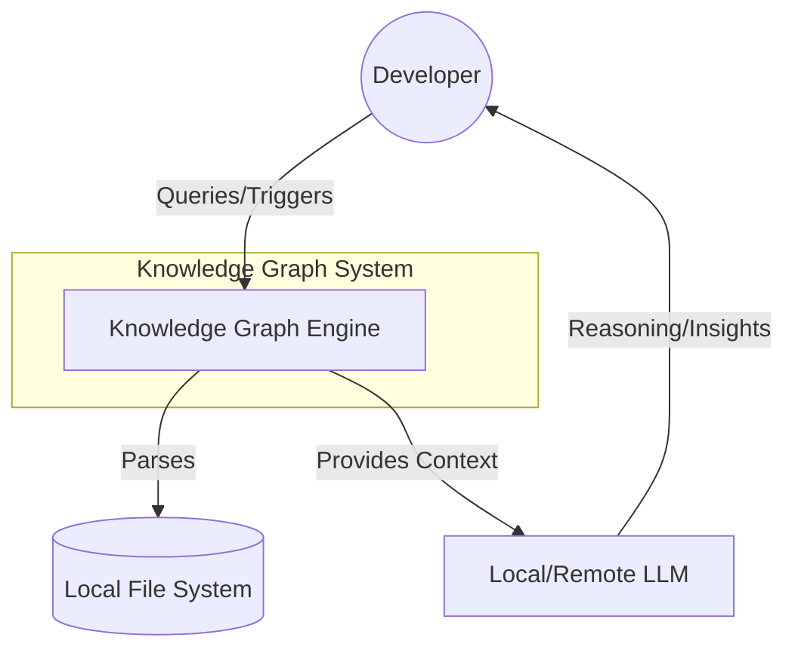

High-Level Design (HLD): Local-First Knowledge Graph for AI-Augmented Engineering (MVP 1.0)

1. Strategic Vision and Project Objectives

In the current landscape of AI-augmented development, vector-only Retrieval-Augmented Generation (RAG) often fails to capture the intricate, hierarchical, and interconnected nature of complex codebases. While vector databases excel at semantic "vibe" checks, they lack the structural determinism required for high-stakes engineering tasks like refactoring impact analysis or call-graph navigation. A local, rule-based Knowledge Graph (KG) provides a superior alternative by transforming raw source code into a verifiable, symbolic map. By prioritizing structural accuracy over fuzzy matching and keeping data processing strictly local, this architecture ensures both developer privacy and a 100% consistent source of truth that traditional RAG cannot replicate.

The objectives for this MVP are centered on four strategic pillars:

* Engineering Efficiency: By utilizing local-first indexing and "zero-dependency" setups, the system eliminates cloud latency. Sub-140ms multi-hop traversal ensures that developer velocity is never throttled by the intelligence layer.
* Structural Accuracy: Unlike flat vector chunks, the KG maps the codebase’s Abstract Syntax Tree (AST). This ensures relationships like function calls and class inheritances are documented with 100% mathematical precision.
* Massive Token Savings: By utilizing advanced retrieval strategies like Vertex Chunks and TOON serialization, we reduce token consumption by up to 95.7%. This significantly lowers LLM operational costs while preventing prompt saturation.
* Local Performance & Privacy: Designing for the local machine ensures that the KG evolves at the same speed as the developer’s environment. Data never leaves the workstation, ensuring compliance with strict security protocols.


--------------------------------------------------------------------------------


2. System Architecture (C4 Model)

The architectural philosophy is "local-first" and "zero-dependency." The system is optimized to run on a standard developer machine, leveraging in-memory graph processing to achieve sub-second reasoning.

C4 Level 1: System Context Diagram



C4 Level 2: Container Diagram

```mermaid
graph TD
    subgraph KG_System [Knowledge Graph System]
        API[REST API]
        MCP[MCP Server]
        Pipeline[Ingestion Pipeline]
        DB[(FalkorDB - In-Memory)]
    end

    User((Developer)) -->|Search/Update| API
    AI_Agent[AI Agent / LLM] -->|Tool Use| MCP
    Pipeline -->|MERGE logic| DB
    API -->|Query| DB
    MCP -->|Query| DB
    FS[(Codebase & Docs)] -->|Raw Data| Pipeline

```mermaid


Architectural Validation The decision to implement a hybrid interface (REST + MCP) is strategic. While the REST API serves traditional developer tools and scripts, the MCP (Model Context Protocol) server integration allows LLMs to "browse" the graph directly as a tool. This duality ensures the KG is both a developer utility and a native intelligence layer for agentic reasoning.


--------------------------------------------------------------------------------


3. Data Ingestion and Processing Pipeline

The ingestion strategy utilizes "Incremental Indexing" via Git diff triggers to maintain a synchronized map of the codebase without redundant processing.

The Ingestion Flow The system processes data through an 8-stage pipeline:

1. Source Discovery: Detects changes in the Git repository via file hashes or webhooks.
2. File Router: Strategically directs code files to AST parsers and documentation (Markdown/PDF) to text parsers.
3. Parser Layer: Analyzes code using Tree-sitter for formal structural entities and documentation via Smart Chunking.
4. Smart Chunking: Segments data into logical blocks (functions/classes) rather than arbitrary character counts, ensuring context for imports and comments is preserved.
5. LLM Enrichment: Synthesizes natural language descriptions for entities to bridge the symbolic-semantic gap.
6. Embedding Generation: Produces vector representations (e.g., BGE-small) for each node to support hybrid search.
7. Validation & Enrichment: Performs Entity Resolution—the most critical phase—to merge duplicate nodes and verify provenance.
8. Output & Push: Commits the nodes and edges to FalkorDB using MERGE logic.

Parsing Strategy The pipeline employs a "rule-based first" approach. Tree-sitter ensures 100% consistency for structural relationships. This deterministic foundation is then enriched—not defined—by LLMs, ensuring the architectural map remains mathematically grounded.


--------------------------------------------------------------------------------


4. Codebase-Centric Ontology & Data Model

The ontology is domain-agnostic yet code-optimized, enabling "multi-hop reasoning" across the software development lifecycle (SDLC).

Node & Property Schema

Label	Mandatory Properties	Purpose
File	path, language, commit_hash, last_updated	Root source of truth.
Class	name, file_path, line_start, line_end, provenance	OO structure mapping.
Function	name, parameters, return_type, embedding	Logic unit mapping.
Variable	name, scope, type	State mapping.
Module	name, path	Package/Module hierarchy.
Artifact	type (Issue/PR), status, linked_commit	SDLC context integration.
DocSection	title, summary, file_path, embedding	Technical documentation units.

Note: All nodes contain a provenance JSON field (e.g., {"author": "...", "git_commit": "..."}) and a 384-dimension vector embedding.

Relationship Mapping

* CONTAINS: Establishes the hierarchy (Module -> File -> Class -> Function).
* CALLS: Maps the execution flow between functions.
* INHERITS_FROM: Captures class hierarchies and polymorphism.
* DEPENDS_ON: Maps external library usage and cross-module imports.
* DOCUMENTS_BY: Connects DocSection nodes to the relevant CodeEntity.


--------------------------------------------------------------------------------


5. Storage Strategy: FalkorDB Local Optimization

FalkorDB is the recommended storage engine for the MVP over Neo4j or off-the-shelf tools like Graphiti.

Performance Benchmarking

Metric	FalkorDB (Recommended)	Neo4j (Community)	Advantage
Query Latency	Sub-140ms (p99)	4–46 seconds (at load)	496x faster traversal.
Memory Usage	42% lower	Higher (Disk-backed)	Optimized for laptops.
Architecture	In-memory + GraphBLAS	Pointer-hopping	Matrix-based optimization.

Strategic Rejection of Graphiti While Graphiti is excellent for temporal "chat memory," it is rejected for this MVP because its domain is not optimized for code (AST relations). A custom pipeline using FalkorDB provides the "local-first" zero-dependency architecture required for sub-5ms MCP server response times.


--------------------------------------------------------------------------------


6. Interface Layer: RESTful APIs & MCP Server

The interface layer bridges static graph storage and the dynamic reasoning of AI agents.

RESTful API Specification

* Search: Hybrid retrieval combining vector similarity with keyword matching.
* Update: Triggers incremental ingestion for specific file hashes or Git commits.
* Retrieve Subgraph: Facilitates "context-aware" retrieval, pulling a localized cluster of nodes.

MCP Server Integration The MCP server exposes the KG directly to the LLM's tool-use layer. This allows the agent to treat the graph as a "browser," navigating CALLS or DEPENDS_ON edges autonomously. It effectively allows the LLM to perform deep codebase exploration without the developer needing to provide manual context.


--------------------------------------------------------------------------------


7. Retrieval and Reasoning (GraphRAG)

To solve "Prompt Saturation," we employ a specialized Token Efficiency layer.

* Hybrid Retrieval Logic: Combines vector-based lookups for "Anchor Nodes" with symbolic link traversal to gather structural context.
* Memory Replay (ReMindRAG): The system "learns" from successful reasoning paths. When an agent finds a correct answer, the weights of those edges are updated in the KG, making future similar queries 50-60% more token-efficient.
* Vertex Chunks: Instead of retrieving atomic facts, the system retrieves a central node and its immediate neighbors. This maximizes KV-cache reuse in the LLM, reducing prefill calculation time.
* Compact Serialization (TOON): Uses "Token-Oriented Object Notation" instead of verbose JSON, reducing token overhead by 60-70%.


--------------------------------------------------------------------------------


8. Lifecycle Management and Incremental Updates

The system maintains graph "freshness" via feedback-driven and session-based update cycles.

Incremental Update Logic When a "Git diff" trigger is received, the system identifies only affected subgraphs. It uses MERGE and SET logic rather than full rebuilds, preserving existing relationships and temporal metadata (valid_from).

The "Hardest Part": Entity Resolution To prevent graph degradation, the system employs a three-pronged Entity Resolution strategy:

1. AST-based Rules: Exact matching for moved files or renamed functions within the same scope.
2. Embedding Similarity: Identifying semantic overlaps in refactored code.
3. LLM Self-Verification: A final validation layer to merge nodes and verify provenance, ensuring the KG remains a 100% consistent source of truth.

Final Summary

This architecture provides a high-performance, local-first foundation for AI-augmented engineering. By combining the deterministic power of Tree-sitter with the speed of FalkorDB's matrix-based operations, we deliver a system that is 496x faster than traditional graph solutions. The integration of Vertex Chunks and Memory Replay ensures that AI agents operate with maximum intelligence at a fraction of the traditional token cost, providing a truly consistent source of truth for modern development workflows.
