# LeanKG High Level Design

**Version:** 2.1-mempalace
**Date:** 2026-04-11
**Based on:** PRD v3.1-mempalace
**Status:** Active
**Codebase Version:** 0.11.1

**Changelog:**
- v2.1-mempalace - MemPalace-inspired features:
  - Added temporal fields (valid_from, valid_to) to Relationship schema
  - Added 2 new relationship types: tunnel, decided_about
  - Added 4 new element types: decision, preference, milestone, problem
  - Added 3 planned modules: conversation, consistency, agents
  - Added Layered Context Loading (L0-L3) architecture
  - Added Temporal Knowledge Graph data flow
  - Added Consistency Check data flow
  - Added 9 planned MCP tools (wake_up, load_layer, temporal_query, timeline, check_consistency, find_tunnels, agent_focus, agent_diary_write, agent_diary_read)
  - Added MemPalace competitive analysis notes
  - Source: https://github.com/milla-jovovich/mempalace
- v2.0 - Full codebase audit rewrite:
  - Converted all Vietnamese content to English
  - Added 6 missing modules: orchestrator, compress, hooks, benchmark, registry, api
  - Updated C4 diagrams to include all 17 modules
  - Updated data model with ContextMetric, QueryCache, ApiKey tables
  - Added all 35 MCP tools to interface specifications
  - Added all 28+ CLI commands
  - Updated parser list to 18 languages (13 fully extracted native programming languages)
  - Added RTK compression architecture
  - Added orchestrator architecture
  - Added git hooks architecture
  - Fixed MCP server tech from "Custom Rust" to "rmcp"
  - Updated relationship types to 10 (was missing tests, implementations)
- v1.19 - Auto-Index on DB Write
- v1.18 - RTK Integration
- v1.13 - Terraform and CI/CD YAML Indexing
- v1.5 - MCP Server Self-Initialization
- v1.2.1 - Migrated from SurrealDB to CozoDB

---

## 1. Architecture Overview

### 1.1 Design Principles

| Principle | Description |
|-----------|-------------|
| **Local-first** | All data and processing runs locally, no cloud dependencies |
| **Single binary** | Application packed as a single binary |
| **Minimal dependencies** | No external services or database processes required |
| **Incremental** | Only process changes, not full re-scan |
| **MCP-native** | Designed from the ground up for MCP protocol |

### 1.2 System Overview

LeanKG is a local-first knowledge graph system providing codebase intelligence for AI coding tools. The system parses code, builds dependency graphs, and exposes interfaces via CLI, MCP server, REST API, and embedded Web UI.

---

## 2. C4 Models

### 2.1 Context Diagram (C4-1)

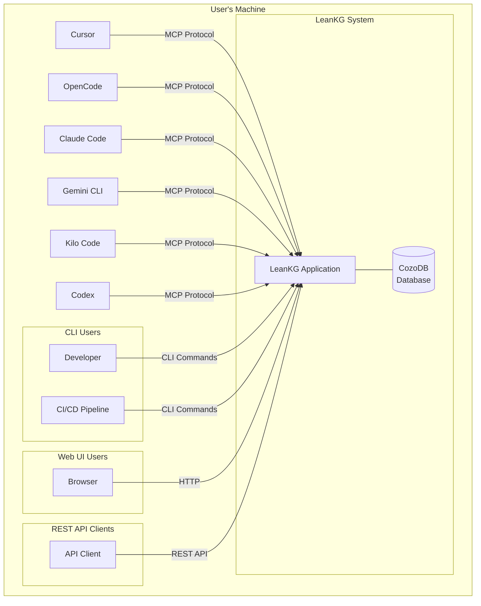

### 2.2 Container Diagram (C4-2)

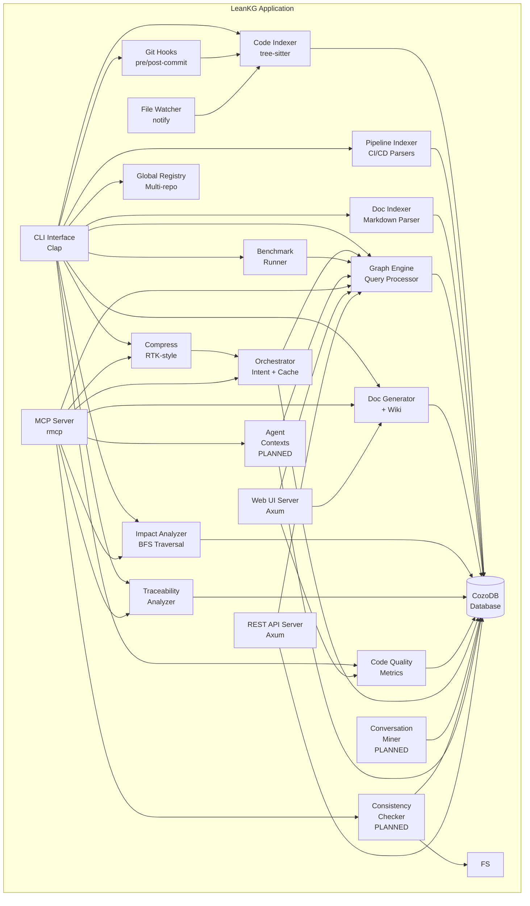

**Containers:**

| Container | Responsibility | Technology |
|-----------|---------------|------------|
| CLI Interface | Command-line interaction (28+ commands) | Clap (Rust) |
| MCP Server | MCP protocol communication (35+9 planned tools) | rmcp (Rust) |
| Web UI Server | HTTP server for graph visualization (20+ routes) | Axum (Rust) |
| REST API Server | REST API with auth | Axum + tower-http (Rust) |
| Code Indexer | Parse source code with tree-sitter (13 languages fully) | tree-sitter (Rust) |
| Pipeline Indexer | Parse CI/CD configuration files | Custom YAML parsers (Rust) |
| Doc Indexer | Parse documentation files and extract code references | pulldown-cmark (Rust) |
| Graph Engine | Query and traverse knowledge graph | Rust + CozoDB Datalog |
| Doc Generator | Generate markdown documentation + wiki | Rust templates |
| File Watcher | Monitor file changes | notify (Rust) |
| Impact Analyzer | Calculate blast radius with confidence scores | Rust (BFS traversal) |
| Traceability Analyzer | Trace requirements to code via documentation | Rust |
| Code Quality | Detect large functions, code metrics | Rust |
| Compress | 8 read modes, response/shell/cargo/git compressors, entropy analysis | Rust |
| Orchestrator | Smart query routing with intent parsing and persistent cache | Rust |
| Git Hooks | pre-commit, post-commit, post-checkout hooks + GitWatcher | Rust (shell script generation) |
| Benchmark | Compare vs OpenCode, Gemini CLI, Kilo CLI | Rust |
| Global Registry | Multi-repo management | Rust + CozoDB |
| CozoDB | Persistent storage (per-project) | CozoDB 0.2 (embedded SQLite-backed) |
| Conversation Miner | [PLANNED] Mine Claude/ChatGPT/Slack transcripts for decisions | Rust (JSON parsing) |
| Consistency Checker | [PLANNED] Detect stale/broken graph links | Rust + CozoDB |
| Agent Contexts | [PLANNED] Specialist agent personas with focused graph views | Rust + CozoDB |

### 2.3 Component Diagram (C4-3)

```mermaid
graph TB
    subgraph "Code Indexer"
        Parser[Parser Manager<br/>13 Parsers]
        GoParser[Go Parser]
        TSParser[TS/JS Parser]
        PyParser[Python Parser]
        RsParser[Rust Parser]
        JavaParser[Java Parser]
        KtParser[Kotlin Parser]
        CppParser[C++ Parser]
        CsParser[C# Parser]
        RbParser[Ruby Parser]
        PhpParser[PHP Parser]
        Extractor[Entity Extractor]
        Builder[Graph Builder]
        
        Parser --> GoParser
        Parser --> TSParser
        Parser --> PyParser
        Parser --> RsParser
        Parser --> JavaParser
        Parser --> KtParser
        Parser --> CppParser
        Parser --> CsParser
        Parser --> RbParser
        Parser --> PhpParser
        
        GoParser --> Extractor
        TSParser --> Extractor
        PyParser --> Extractor
        RsParser --> Extractor
        JavaParser --> Extractor
        KtParser --> Extractor
        CppParser --> Extractor
        CsParser --> Extractor
        RbParser --> Extractor
        PhpParser --> Extractor
        
        Extractor --> Builder
    end
    
    subgraph "Graph Engine"
        Query[Query Processor]
        Search[Search Engine]
        Relate[Relationship Engine]
        Cache[Query Cache]
        Cluster[Community Detector]
        Export[Export: HTML/SVG/GraphML/Neo4j]
        
        Query --> Search
        Query --> Relate
        Search --> Cache
        Relate --> Cache
        Query --> Cluster
        Query --> Export
    end
    
    subgraph "Impact Analyzer"
        BFS[BFS Traversal]
        QualNorm[Qualified Name Normalizer]
        Radius[Radius Calculator]
        Context[Review Context Generator]
        ImpactCache[Impact Cache]
        
        BFS --> QualNorm
        QualNorm --> Radius
        Radius --> Context
        Radius --> ImpactCache
    end
    
    subgraph "Compress Module"
        FileReader[File Reader<br/>8 Read Modes]
        ResponseComp[Response Compressor]
        ShellComp[Shell Compressor]
        CargoComp[CargoTest Compressor]
        GitDiffComp[GitDiff Compressor]
        Entropy[Entropy Analyzer]
        
        FileReader --> Entropy
        ResponseComp --> Entropy
    end
    
    subgraph "Orchestrator"
        Intent[Intent Parser<br/>7 Query Types]
        OrchCache[Persistent Cache<br/>CozoDB-backed]
        Router[Query Router]
        
        Intent --> Router
        Router --> OrchCache
    end
    
    subgraph "Git Hooks"
        PreCommit[Pre-commit Hook<br/>Critical file blocking]
        PostCommit[Post-commit Hook<br/>Auto reindex]
        PostCheckout[Post-checkout Hook<br/>Branch switch reindex]
        GitWatch[GitWatcher<br/>Continuous freshness]
        
        PreCommit --> GitWatch
        PostCommit --> GitWatch
        PostCheckout --> GitWatch
    end
    
    subgraph "MCP Server"
        Protocol[MCP Protocol<br/>rmcp]
        Handler[Request Handler<br/>35 tools]
        Tools[Tool Registry]
        WriteTracker[Write Tracker<br/>Atomic dirty flag]
        
        Protocol --> Handler
        Handler --> Tools
        Handler --> WriteTracker
    end
    
    Builder -->|Writes| DB[(CozoDB)]
    Query -.->|Reads| DB
    Tools -.->|Queries| Graph
    BFS -.->|Reads| DB
    OrchCache -.->|Reads/Writes| DB
```

### 2.4 Deployment Diagram (C4-4)

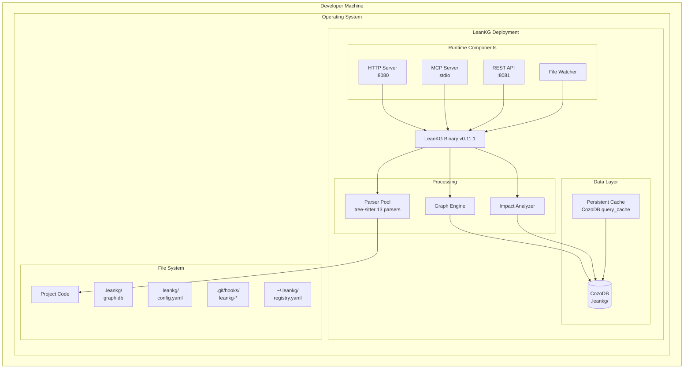

**Deployment Scenarios:**

| Scenario | Environment | Resources |
|----------|-------------|-----------|
| macOS Intel | macOS x64 | < 100MB RAM, < 200MB disk |
| macOS Apple Silicon | macOS ARM64 | < 100MB RAM, < 200MB disk |
| Linux x64 | Linux x64 | < 100MB RAM, < 200MB disk |
| Linux ARM64 | Linux ARM64 | < 100MB RAM, < 200MB disk |

**Processes:**

| Process | Port | Description |
|---------|------|-------------|
| LeanKG Binary | - | Main application process |
| HTTP Server | 8080 | Web UI server (optional) |
| REST API Server | 8081 | REST API with auth (optional) |
| MCP Server | stdio | MCP protocol via stdin/stdout |
| File Watcher | - | Background notify process |
| CozoDB | - | Embedded SQLite-backed database |

---

## 3. Data Flow

### 3.1 Indexing Flow

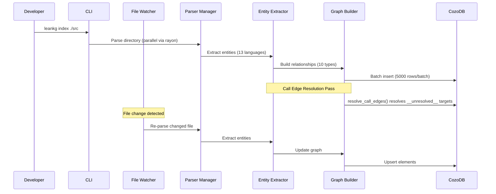

### 3.2 Query Flow

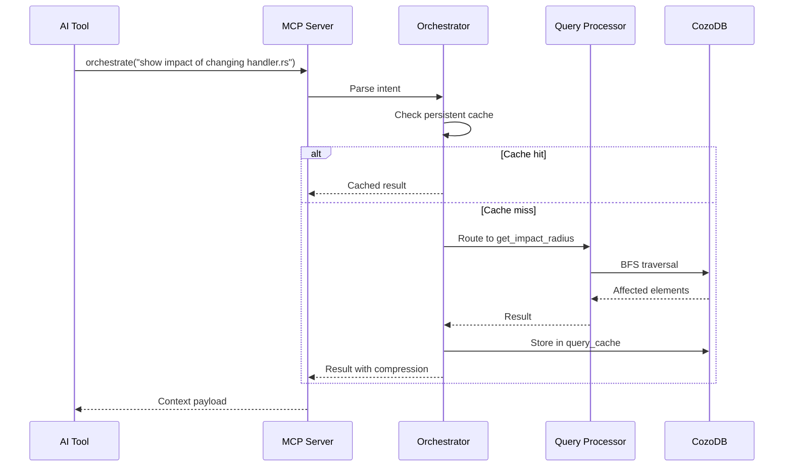

### 3.3 Impact Analysis Flow

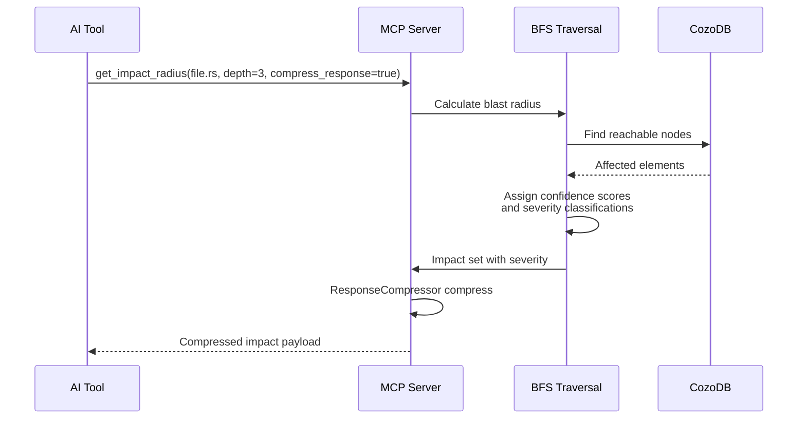

### 3.4 Pre-Commit Change Detection Flow

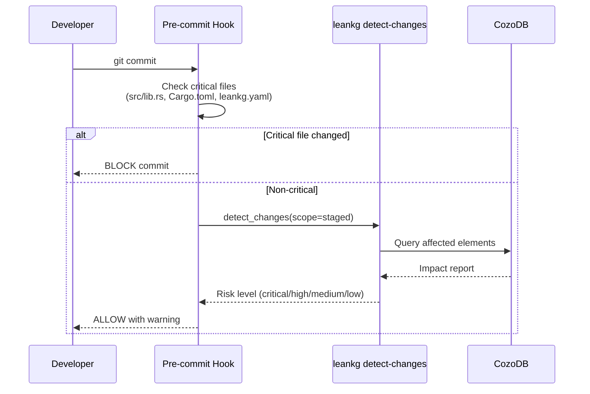

### 3.5 Temporal Query Flow (PLANNED)

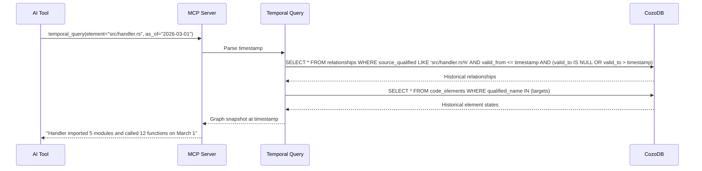

### 3.6 Wake-up Context Flow (PLANNED)

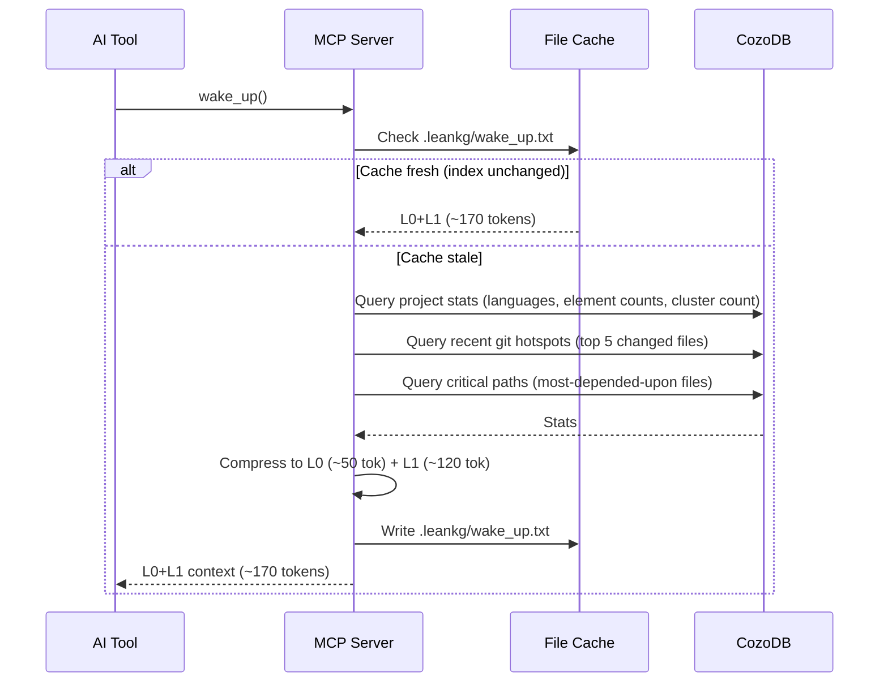

### 3.7 Consistency Check Flow (PLANNED)

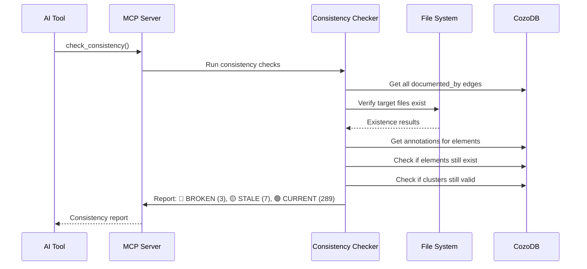

---

## 4. Data Model

### 4.1 Entity Relationship Diagram

```mermaid
erDiagram
    CODE_ELEMENTS ||--o{ RELATIONSHIPS : has
    CODE_ELEMENTS ||--o| BUSINESS_LOGIC : describes
    CODE_ELEMENTS ||--o| DOCUMENTS : referenced_by
    USER_STORIES ||--o{ BUSINESS_LOGIC : mapped_to
    FEATURES ||--o{ BUSINESS_LOGIC : implements
    AGENTS ||--o{ AGENT_DIARY : writes

    CODE_ELEMENTS {
        string qualified_name PK
        string type
        string name
        string file_path
        int line_start
        int line_end
        string language
        string parent_qualified FK
        string cluster_id
        string cluster_label
        json metadata
    }

    RELATIONSHIPS {
        string source_qualified FK
        string target_qualified FK
        string rel_type
        float confidence
        int valid_from
        int valid_to
        json metadata
    }

    BUSINESS_LOGIC {
        string element_qualified PK_FK
        string description
        string user_story_id FK
        string feature_id FK
    }

    DOCUMENTS {
        string id PK
        string title
        string content
        string file_path
        string generated_from
        int last_updated
    }

    CONTEXT_METRICS {
        string tool_name
        int timestamp
        string project_path
        int input_tokens
        int output_tokens
        int tokens_saved
        float savings_percent
    }

    QUERY_CACHE {
        string cache_key PK
        string value_json
        int created_at
        int ttl_seconds
        string tool_name
    }

    API_KEYS {
        string id PK
        string name
        string key_hash
        int created_at
    }

    AGENTS {
        string id PK
        string name
        string focus
        json filters
        int created_at
    }

    AGENT_DIARY {
        string id PK
        string agent_id FK
        string content
        int created_at
        string context
    }
```

### 4.2 Schema Description

| Table | Description | Indexes |
|-------|-------------|---------|
| `code_elements` | All code/doc/pipeline/conversation elements. PK = qualified_name (`file_path::parent::name`) | PK: qualified_name |
| `relationships` | 12 relationship types (10 original + tunnel + decided_about) with temporal validity | rel_type_index, target_qualified_index, valid_from_index |
| `business_logic` | Business logic annotations per element | PK: element_qualified |
| `context_metrics` | 18-field metrics tracking per MCP tool call | tool_name_index, timestamp_index, project_path_index |
| `query_cache` | Persistent cache for orchestrator results | unique: cache_key, tool_name_index |
| `agents` | [PLANNED] Specialist agent definitions with focus areas | PK: id |
| `agent_diary` | [PLANNED] Per-agent session notes | PK: id, agent_id_index |

### 4.3 Element Types

| Element Type | qualified_name Format | Description |
|-------------|----------------------|-------------|
| `directory` | `path/to/dir/` | [PLANNED] A source code directory (trailing slash distinguishes from files) |
| `file` | `path/to/file.rs` | A source code file |
| `function` | `path/to/file.rs::function_name` | A function or method |
| `class` | `path/to/file.rs::ClassName` | A class, struct, or interface |
| `import` | `path/to/file.rs::import_alias` | An import statement |
| `export` | `path/to/file.rs::export_name` | An export |
| `document` | `docs/path/to/file.md` | A documentation file |
| `doc_section` | `docs/path/to/file.md::section_name` | A section within a document |
| `pipeline` | `path/to/ci.yml::pipeline_name` | A CI/CD pipeline |
| `pipeline_stage` | `path/to/ci.yml::pipeline::stage` | A pipeline stage |
| `pipeline_step` | `path/to/ci.yml::pipeline::stage::step` | A pipeline step |
| `terraform` | `path/to/file.tf::resource_type.name` | A Terraform resource |
| `cicd` | `path/to/ci.yml::job_name` | A CI/CD job |
| `decision` | `conversations/source::decision_hash` | [PLANNED] A decision extracted from conversations |
| `preference` | `conversations/source::preference_hash` | [PLANNED] A user preference extracted from conversations |
| `milestone` | `conversations/source::milestone_hash` | [PLANNED] A project milestone from conversations |
| `problem` | `conversations/source::problem_hash` | [PLANNED] A problem/issue from conversations |

### 4.4 Folder-as-Graph Hierarchy (PLANNED)

> Maps directory structure into the knowledge graph, inspired by MemPalace's wing/room/closet/drawer spatial architecture.

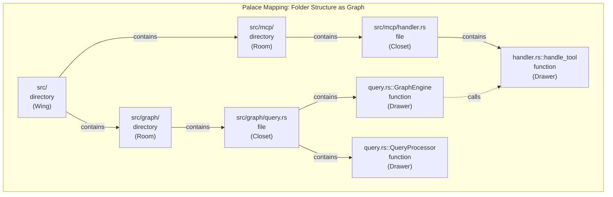

**Hierarchy levels:**

| MemPalace Level | LeanKG Level | Element Type | `contains` Edge |
|-----------------|-------------|-------------|-----------------|
| Wing (project area) | Top-level directory | `directory` | dir → dir |
| Room (module/topic) | Sub-directory | `directory` | dir → dir |
| Closet (file) | Source file | `file` | dir → file |
| Drawer (element) | Function/class | `function`/`class` | file → element |

**Directory metadata JSON:**
```json
{
  "child_count": 12,
  "language_distribution": {"rust": 8, "typescript": 4},
  "total_lines": 3420,
  "file_types": [".rs", ".ts"]
}
```

### 4.4 Relationship Types

| Type | Source → Target | Description | Confidence | Temporal |
|------|-----------------|-------------|------------|----------|
| `imports` | file → file | Module A imports module B | 1.0 | Yes |
| `calls` | function → function | Function A calls function B | 0.5-1.0 | Yes |
| `references` | document → code_element | Doc references code element | 1.0 | Yes |
| `documented_by` | code_element → document | Code is documented by doc | 1.0 | Yes |
| `tested_by` | code_element → test_function | Code is tested by test | 1.0 | Yes |
| `tests` | test_function → code_element | Test tests code | 1.0 | Yes |
| `contains` | parent → child | Parent contains child: dir→dir, dir→file, file→function/class, doc→section | 1.0 | No |
| `defines` | file → element | File defines element | 1.0 | No |
| `implements` | struct → interface | Struct implements interface (Go) | 1.0 | Yes |
| `implementations` | interface → struct | Interface implementations | 1.0 | Yes |
| `tunnel` | cluster → cluster | [PLANNED] Cross-cluster domain link | 0.5-1.0 | No |
| `decided_about` | decision → code_element | [PLANNED] Decision relates to code | 0.7-1.0 | Yes |

---

## 5. Interface Specifications

### 5.1 CLI Commands

| Command | Flags | Description |
|---------|-------|-------------|
| `init` | `--path` | Initialize LeanKG project |
| `index` | `[path]`, `-i`, `-l`, `--exclude`, `-v` | Index codebase (parallel via rayon) |
| `query` | `<query>`, `--kind` | Query knowledge graph |
| `generate` | `-t/--template` | Generate documentation |
| `web` | `--port` | Start embedded web UI |
| `mcp-stdio` | `--watch`, `--project-path` | Start MCP server (stdio) |
| `impact` | `<file>`, `--depth` | Calculate impact radius |
| `install` | | Auto-install MCP config |
| `status` | | Show index status |
| `watch` | `--path` | Start file watcher |
| `quality` | `--min-lines`, `--lang` | Find oversized functions |
| `export` | `--format`, `--output`, `--file`, `--depth` | Export graph (json/dot/mermaid/html/svg/graphml/neo4j) |
| `annotate` | `<element>`, `-d`, `--user-story`, `--feature` | Add business logic annotation |
| `link` | `<element>`, `<id>`, `--kind` | Link element to story/feature |
| `search-annotations` | `<query>` | Search annotations |
| `show-annotations` | `<element>` | Show annotations |
| `trace` | `--feature`, `--user-story`, `-a` | Traceability chain |
| `find-by-domain` | `<domain>` | Find by business domain |
| `benchmark` | `--category`, `--cli` | Run benchmarks |
| `register` | `<name>` | Register repo in global registry |
| `unregister` | `<name>` | Unregister repo |
| `list` | | List registered repos |
| `status-repo` | `<name>` | Show repo status |
| `setup` | | Global MCP setup |
| `run` | `<command>`, `--compress` | Run shell command with compression |
| `detect-clusters` | `--path`, `--min-hub-edges` | Community detection |
| `api-serve` | `--port`, `--auth` | Start REST API |
| `api-key` | `create/list/revoke` | API key management |
| `hooks` | `install/uninstall/status/watch` | Git hooks management |
| `wiki` | `--output` | Generate wiki |
| `metrics` | `--since`, `--tool`, `--json`, `--reset`, `--seed` | Context metrics |
| `version` | | Show version |

### 5.2 MCP Tools (35 total)

See PRD Section 7 for complete list.

**Auto-Initialization Behavior:**
When MCP server starts via `mcp-stdio` and detects no `.leankg/` exists, it automatically:
1. Runs init (creates .leankg/ and leankg.yaml)
2. Runs index on the current directory
3. Serves normally

**Auto-Indexing on Startup:**
When MCP server starts with existing project:
1. Checks staleness by comparing git HEAD commit time vs database file time
2. If stale, runs incremental indexing automatically

**Auto-Indexing on DB Write:**
1. **WriteTracker** - In-memory `Arc<AtomicBool>` dirty flag + `Arc<RwLock<Instant>>` last_write_time
2. **TrackingDb** - Wraps `CozoDb` to intercept `:put` and `:delete` operations
3. **Lazy Reindex** - On any MCP tool call, checks dirty flag; if set, triggers incremental reindex

### 5.3 REST API Routes

| Route | Method | Description |
|-------|--------|-------------|
| `/health` | GET | Health check (version + status) |
| `/api/v1/status` | GET | Element/relationship/annotation counts |
| `/api/v1/search?q=&limit=` | GET | Search code elements |

**Auth:** Bearer token via API key (Argon2 hashed). Auth middleware implemented but not yet wired into routes.

### 5.4 Web UI Routes

| Route | Description |
|-------|-------------|
| `/` | Main dashboard |
| `/graph` | Interactive graph visualization (sigma.js) |
| `/browse` | Code browser |
| `/docs` | Documentation viewer |
| `/annotate` | Business logic annotation |
| `/quality` | Code quality metrics |
| `/export` | Generate HTML graph export |
| `/settings` | Configuration |
| `/project` | Project management |
| `/api/graph/data` | Graph data API |
| `/api/elements` | Elements CRUD |
| `/api/relationships` | Relationships CRUD |
| `/api/annotations` | Annotations CRUD |
| `/api/search` | Search API |
| `/api/query` | Query API |

---

## 6. Security Considerations

### 6.1 Datalog String Escaping

All user-provided strings in Datalog queries are escaped using `escape_datalog`:
```rust
fn escape_datalog(s: &str) -> String {
    s.replace('\\', "\\\\").replace('"', "\\\"")
}
```

### 6.2 API Key Security

| Concern | Mitigation |
|---------|------------|
| Key storage | Argon2 hash (no plaintext) |
| Key transport | Bearer token over HTTPS recommended |
| Key rotation | Revoke + create new key |

### 6.3 Local Security

| Concern | Mitigation |
|---------|------------|
| Data at rest | Database file stored locally |
| MCP access | stdio transport (local only) |
| HTTP exposure | Bind to localhost only by default |
| File access | Sandboxed to project directory |

---

## 7. Performance Targets

| Operation | Target | Notes |
|-----------|--------|-------|
| Cold start | < 2s | Binary initialization |
| Index speed | > 10K LOC/s | Parallel via rayon, batch 5000/batch |
| Query latency | < 100ms | Graph queries with cache |
| Memory idle | < 100MB | No active operations |
| Memory peak | < 500MB | During indexing |
| Disk footprint | < 50MB/100K LOC | Database size |

---

## 8. Configuration

```yaml
project:
  name: my-project
  root: ./src
  languages:
    - go
    - typescript
    - python
    - rust

indexer:
  exclude:
    - "**/node_modules/**"
    - "**/vendor/**"
  include:
    - "*.go"
    - "*.ts"
    - "*.py"

pipeline:
  enabled: true
  auto_detect: true

mcp:
  enabled: true
  auto_index_on_start: true
  auto_index_threshold_minutes: 5
  auto_index_on_db_write: true
  index_on_first_call: true

web:
  enabled: true
  port: 8080

documentation:
  output: ./docs
  templates:
    - agents
    - claude
```

---

## 9. Error Handling

| Category | Handling | User Feedback |
|----------|----------|---------------|
| Parse errors | Skip file, log warning | Warning in CLI output |
| Database errors | Retry with backoff | Error message |
| MCP errors | Return error response | MCP error payload |
| File system errors | Graceful degradation | Warning |

---

## 10. Future Considerations

### 10.1 Near-term (Current Sprint)

- npm-based installation (US-14)
- Dart entity extraction (US-LANG-01)
- Swift entity extraction (US-LANG-02)
- REST API auth wiring + mutation endpoints

### 10.2 MemPalace-Inspired Features (Phase 3.5)

> Competitive analysis source: [MemPalace](https://github.com/milla-jovovich/mempalace) — 96.6% LongMemEval R@5, 40.4k GitHub stars, local-first memory system.

| Feature | Description | PRD Story | Priority |
|---------|-------------|-----------|----------|
| Temporal Knowledge Graph | valid_from/valid_to on relationships, historical queries | US-MP-01 | Must Have |
| Layered Context (L0-L3) | Token-budgeted context layers, wake_up tool | US-MP-02 | Must Have |
| Conversation Mining | Mine Claude/ChatGPT/Slack for decisions & preferences | US-MP-03 | Should Have |
| Specialist Agents | Focused agent personas with per-agent diaries | US-MP-04 | Should Have |
| Consistency Checking | Detect stale/broken graph links | US-MP-05 | Should Have |
| Cross-Domain Tunnels | Auto-link shared domain concepts across clusters | US-MP-06 | Could Have |
| Wake-up Protocol | ~170 token project bootstrap at session start | US-MP-07 | Should Have |

**Key MemPalace concepts adapted for LeanKG:**

| MemPalace Concept | LeanKG Equivalent | Status |
|-------------------|-------------------|--------|
| Wings (person/project) | Clusters (functional communities) | DONE |
| Rooms (topics within wing) | Cluster labels + element types | DONE |
| Closets (summaries) | RTK compression (8 read modes) | DONE |
| Drawers (verbatim files) | ctx_read (full mode) | DONE |
| Halls (memory types: facts, events, preferences) | Element types + relationship types | PARTIAL (need decision/preference types) |
| Tunnels (cross-wing links) | Cross-cluster tunnels | PLANNED (US-MP-06) |
| AAAK compression | RTK compression | DONE (different approach: LeanKG uses structure-aware compression, not entity abbreviation) |
| L0-L3 memory stack | Orchestrator + context layers | PLANNED (US-MP-02) |
| Temporal validity | Relationship valid_from/valid_to | PLANNED (US-MP-01) |
| Specialist agents | Agent contexts | PLANNED (US-MP-04) |
| Contradiction detection | Consistency checker | PLANNED (US-MP-05) |
| Auto-save hooks | Git hooks + WriteTracker | DONE (git hooks only; session hooks not planned) |

### 10.3 Phase 4 Features

- Vector embeddings for semantic search
- Cloud sync option
- Team features (shared knowledge graphs)
- Plugin system

---

## 11. Dependencies

### 11.1 Direct Dependencies

| Dependency | Version | Purpose |
|------------|---------|---------|
| cozo | 0.2 | Embedded SQLite-backed relational-graph database |
| rmcp | 1.2 | MCP protocol server |
| tree-sitter | 0.25 | Code parsing |
| clap | 4 | CLI framework |
| notify | 7 | File watching |
| axum | 0.7 | Web server + REST API |
| tower-http | 0.6 | CORS middleware |
| tokio | 1 | Async runtime |
| serde | 1 | Serialization |
| rayon | 1.10 | Parallel processing |
| pulldown-cmark | 0.12 | Markdown parsing |
| regex | 1 | Pattern matching |
| argon2 | 0.5 | API key hashing |
| uuid | 1 | Unique IDs |

### 11.2 tree-sitter Parsers

| Parser | Version | Language |
|--------|---------|----------|
| tree-sitter-go | 0.25 | Go |
| tree-sitter-typescript | 0.23 | TypeScript/JavaScript |
| tree-sitter-python | 0.25 | Python |
| tree-sitter-rust | 0.24 | Rust |
| tree-sitter-java | 0.23 | Java |
| tree-sitter-kotlin-ng | 1.1.0 | Kotlin |
| tree-sitter-cpp | 0.23 | C/C++ |
| tree-sitter-c-sharp | 0.23 | C# |
| tree-sitter-ruby | 0.23 | Ruby |
| tree-sitter-php | 0.23 | PHP |
| tree-sitter-dart | 0.1 | Dart (parser only) |
| tree-sitter-swift | 0.7 | Swift (parser only) |
| tree-sitter-xml | 0.7 | XML (parser only) |

---

## 12. Glossary

| Term | Definition |
|------|------------|
| Container | Executable process in C4 model |
| Component | Internal module of a container |
| Code element | File, function, class, import in codebase |
| Context | Information provided to AI tool |
| Blast radius / Impact radius | Files affected by a change within N hops |
| Qualified name | Natural node identifier: `file_path::parent::name` |
| TESTED_BY | Relationship: test file tests production code |
| Confidence Score | Float 0.0-1.0 indicating edge reliability |
| Severity Classification | WILL BREAK / LIKELY AFFECTED / MAY BE AFFECTED |
| Cluster | Functional community of code elements (Leiden algorithm) |
| Read Mode | File compression mode: adaptive, full, map, signatures, diff, aggressive, entropy, lines |
| Orchestrator | Smart query routing with intent parsing and persistent cache |
| GitWatcher | Component monitoring git events for index freshness |
| Global Registry | Multi-repo management for cross-project queries |
| RTK | Rust Token Killer - compression module reducing LLM token consumption |
| Entropy Analysis | Shannon entropy, Jaccard similarity, Kolmogorov adjustment for information density |
| Temporal Graph | Relationships with valid_from/valid_to timestamps enabling historical queries |
| Context Layer (L0-L3) | L0: Identity (~50 tok), L1: Critical facts (~120 tok), L2: Cluster (on demand), L3: Deep search (on demand) |
| Tunnel | Cross-cluster relationship linking the same domain concept across different modules |
| Consistency Check | Detection of stale/broken links between graph elements and actual code state |
| Wake-up Protocol | Loading minimal L0+L1 context (~170 tokens) at session start for instant project awareness |

---

*Last updated: 2026-04-11 (v2.1-mempalace, MemPalace-inspired features)*
