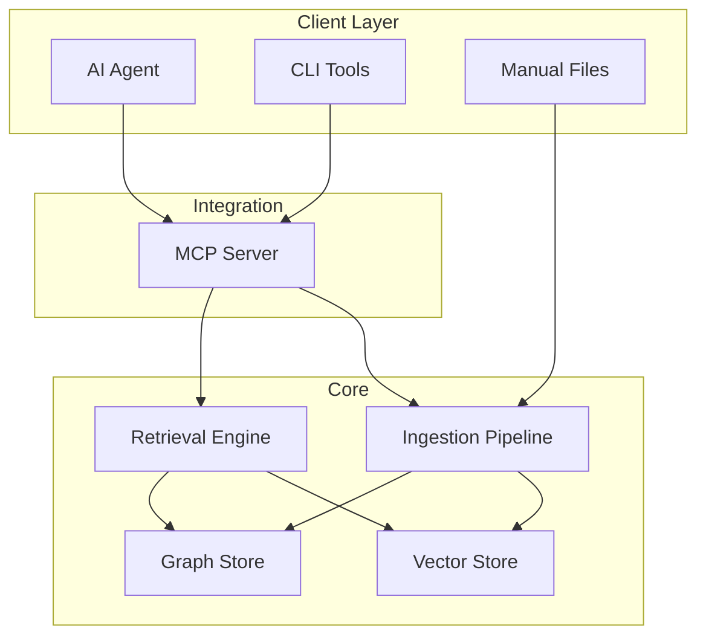
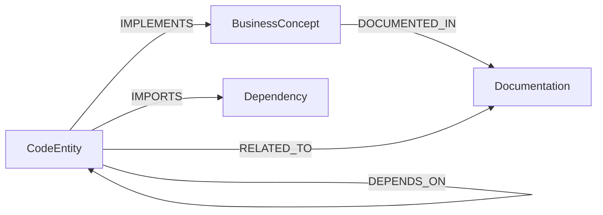

# PRD: Open-Source Knowledge Graph for AI Agents

**Version:** 0.1  
**Status:** Draft  
**Last Updated:** 2026-03-21

---

## 1. Executive Summary

### 1.1 Objective

Build an open-source Knowledge Graph (KG) system that enables AI agents to:

- **Search** knowledge semantically and structurally
- **Retrieve** relevant context with high precision
- **Update** the knowledge tree incrementally and accurately
- **Optimize token usage** for context injection

### 1.2 Problem Statement

AI agents (Claude Code, Cursor, OpenCode, MCP-based tools) face:

| Problem | Impact |
|---------|--------|
| Full codebase scans on every context switch | Slow, redundant, token-heavy |
| No persistent memory between sessions | Repeated explanations, lost business context |
| Pure vector retrieval misses relationships | Incomplete graph traversal, no multi-hop reasoning |
| No incremental updates | Full re-index on change, wasteful |

**Goal:** A local-first, open-source KG that serves as a durable, queryable, token-efficient memory layer for AI agents.

### 1.3 Success Criteria

| Metric | Target | Evidence |
|--------|--------|----------|
| Context retrieval latency | p95 < 500ms | Instrumented queries |
| Retrieval relevance | > 80% "helpful" | Human eval or agent feedback |
| Token efficiency vs naive RAG | >= 30% reduction | Compare token count per query |
| Incremental update overhead | < 10% of full rebuild | Benchmark append vs full ingest |

---

## 2. Scope and Boundaries

### 2.1 In-Scope

- Local-first KG storage (SQLite + vector index)
- Hybrid search: vector similarity + graph traversal + full-text
- MCP server interface (Tools, Resources)
- CLI for ingestion and query
- Incremental indexing with change detection
- Token-aware context formatting (truncation, summarization)
- Open-source license (MIT/Apache 2.0)

### 2.2 Out-of-Scope

- Cloud-hosted SaaS offering
- Real-time collaborative editing
- Multi-tenant access control
- Proprietary embedding APIs as sole option (Ollama/local must be supported)

---

## 3. Architecture Overview

### 3.1 High-Level Architecture



### 3.2 Component Responsibilities

| Component | Responsibility |
|-----------|-----------------|
| **Graph Store** | Entities, relationships, FTS5 full-text index |
| **Vector Store** | Embeddings, semantic similarity search |
| **Retrieval Engine** | Hybrid search, ranking, token-budget formatting |
| **Ingestion Pipeline** | Parse, chunk, embed, deduplicate, update graph |
| **MCP Server** | Tools (add_knowledge, query_context, update), Resources (knowledge://) |

### 3.3 Reference Implementations

| Project | Reference | Notes |
|---------|-----------|-------|
| code-context | `freepeak/code-context` | SQLite + FTS5, Ollama embeddings, Phase 2 MCP planned |
| Mem0 | [docs.mem0.ai](https://docs.mem0.ai) | Graph + vector dual storage; ~26% accuracy, ~90% fewer tokens vs naive |
| GraphRAG | [microsoft/graphrag](https://microsoft.github.io/graphrag) | Community detection, reports, incremental via `graphrag.append` |
| LlamaIndex | [Property Graph Index](https://docs.llamaindex.ai) | Cypher queries, hybrid retrieval |

---

## 4. Knowledge Graph Model

### 4.1 Entity Types

| Type | Purpose | Key Properties |
|------|---------|----------------|
| **CodeEntity** | Source code elements | file_path, line_range, type (function/class/module), signature |
| **BusinessConcept** | Domain knowledge | name, description, domain, tags |
| **Documentation** | Docs, specs, URLs | title, source_type, content_hash |
| **Dependency** | External packages | package_name, version, import_path |

### 4.2 Relationship Types



### 4.3 Storage Schema (SQLite)

Reference: `code-context/internal/graph/schema.sql`

- `entities`: uuid, type, name, description, properties (JSON), timestamps
- `relationships`: source_uuid, target_uuid, relationship_type, properties
- `entities_fts`: FTS5 virtual table on name, description, properties
- `embeddings`: entity_uuid, chunk_index, chunk_text, embedding_model
- `documents`: entity_uuid, content_type, raw_content, file_path, content_hash

---

## 5. Retrieval Mechanisms

### 5.1 Hybrid Search Strategy

| Stage | Method | Purpose |
|-------|--------|---------|
| 1. Candidate | Vector similarity | Semantic match, top-K |
| 2. Expansion | Graph traversal | Related entities, multi-hop |
| 3. Rerank | Relevance + structural + recency | Final ordering |
| 4. Format | Token-budget truncation | Fit context window |

### 5.2 Token-Efficient Patterns

| Pattern | Description | Source |
|---------|-------------|--------|
| **Hybrid Vector + Graph** | Vector for candidates, graph for related context | Mem0, Graphiti |
| **Adaptive top-K** | Adjust based on query complexity, token budget | AdaComp (arxiv 2409.01579) |
| **Context compression** | Summarize or truncate before injection | xRAG, context window mgmt |
| **Priority-based selection** | Relevance > recency > authority | Context Window Optimization |

### 5.3 Query API Contract

```
query_context({
  query: string,
  top_k?: number,        // default 5
  max_tokens?: number,   // budget for context
  filters?: { type?, domain?, tags? },
  include_graph?: boolean,  // expand via relationships
  format?: "compact" | "full"
}) => SearchResult[]
```

---

## 6. Update Mechanisms

### 6.1 Incremental Indexing

| Approach | Implementation | Reference |
|----------|----------------|------------|
| **Change detection** | content_hash, file mtime, version | GraphRAG `graphrag.append` |
| **Targeted updates** | Reprocess only changed/new chunks | GraphRAG PR #1318 |
| **Separate update storage** | `update_index_storage` for append | GraphRAG architecture |
| **Prune stale** | `lastSeen < date() - N days` for dormant nodes | Mem0 |

### 6.2 Update API Contract

```
add_knowledge({
  content: string,
  type: "markdown" | "code" | "url",
  metadata?: { domain?, tags?, related_code? }
}) => { entity_uuid, chunks_indexed }

update_knowledge({
  entity_uuid: string,
  content?: string,
  metadata?: object
}) => { updated }

delete_knowledge({
  entity_uuid: string
}) => { deleted }
```

---

## 7. MCP Integration

### 7.1 Tools

| Tool | Input | Output | Purpose |
|------|-------|--------|---------|
| `add_knowledge` | content, type, metadata | entity_uuid, chunks | Ingest new knowledge |
| `query_context` | query, top_k, filters | SearchResult[] | Retrieve context |
| `update_knowledge` | entity_uuid, content, metadata | updated | Update existing |
| `delete_knowledge` | entity_uuid | deleted | Remove entity |

### 7.2 Resources

| URI Pattern | Content |
|-------------|---------|
| `knowledge://entities/{uuid}` | Single entity with relationships |
| `knowledge://docs/{domain}` | Entities in domain |
| `knowledge://search?q={query}` | Query result snapshot |

### 7.3 Prompts (Optional)

| Name | Purpose |
|------|---------|
| `context_template` | Format retrieved context for agent prompt |
| `annotation_prompt` | Guide AI to extract entities from user input |

---

## 8. Ingestion Pipeline

### 8.1 Supported Inputs

| Format | Parser | Entity Types Created |
|--------|--------|---------------------|
| Markdown + YAML frontmatter | Native | BusinessConcept, CodeEntity (from related_code) |
| Source code | AST or regex | CodeEntity |
| PDF | PDF parser (e.g. pdfcpu, poppler) | Documentation |
| URL | HTTP + readability | Documentation |

### 8.2 Chunking Strategy

Reference: `code-context/internal/embeddings/pipeline.go`

- Word-based chunking (configurable `chunk_size`, default 500)
- Overlap ratio (default 0.2) for context continuity
- Entity-level chunks for graph nodes; sub-chunks for long docs

### 8.3 Embedding Options

| Provider | Model | Dimension | Cost |
|----------|-------|-----------|------|
| Ollama (local) | nomic-embed-text | 768 | Free |
| OpenAI | text-embedding-3-small | 1536 | API cost |
| HuggingFace | sentence-transformers | Configurable | Free/API |

---

## 9. Technology Stack

### 9.1 Option A: Lightweight (Default)

| Component | Choice | Rationale |
|-----------|--------|-----------|
| Graph | SQLite + FTS5 | Local, no server, proven in code-context |
| Vector | Hnswlib or chromem-go | Embeddable, no separate service |
| Embeddings | Ollama | Local, free, no API key |
| Transport | MCP stdio/SSE | Cursor, Claude Desktop, IDE integration |

### 9.2 Option B: Scale-Oriented

| Component | Choice | Rationale |
|-----------|--------|-----------|
| Graph | Neo4j Community / Kuzu | Cypher, graph-native |
| Vector | Qdrant / pgvector | Dedicated vector DB |
| Embeddings | OpenAI / Voyage | Higher quality, paid |

---

## 10. Implementation Roadmap

### Phase 1: Core (Weeks 1-2)

- [ ] SQLite schema (entities, relationships, FTS5, embeddings)
- [ ] Chunking + embedding pipeline (Ollama)
- [ ] Markdown ingestion with frontmatter
- [ ] Hybrid retrieval (FTS5 + vector, basic graph traversal)
- [ ] CLI: ingest, search

### Phase 2: MCP Server (Week 3)

- [ ] MCP stdio/SSE transport
- [ ] Tools: add_knowledge, query_context
- [ ] Resources: knowledge://entities/*
- [ ] Cursor/Claude Desktop config example

### Phase 3: Update & Token Optimization (Week 4-5)

- [ ] Incremental indexing (content_hash, change detection)
- [ ] update_knowledge, delete_knowledge tools
- [ ] Token-budget context formatting
- [ ] max_tokens parameter in query_context

### Phase 4: Advanced Ingestion (Week 6+)

- [ ] PDF parser
- [ ] URL fetcher
- [ ] Code AST ingestion (optional)
- [ ] AI-assisted entity extraction prompts

---

## 11. Open Questions

1. **Conflict resolution:** Contradictory annotations from different sources?
2. **Staleness:** Auto-expire nodes when related code changes?
3. **Sharing:** Git-friendly export (JSON/YAML) for team knowledge bases?
4. **Privacy:** Filter sensitive content from embeddings; local-only default?

---

## 12. References

| Source | URL |
|--------|-----|
| Mem0 Graph Memory | https://docs.mem0.ai/open-source/features/graph-memory |
| Mem0 Vector vs Graph | https://docs.mem0.ai/cookbooks/essentials/choosing-memory-architecture-vector-vs-graph |
| GraphRAG Architecture | https://microsoft.github.io/graphrag/index/architecture/ |
| LlamaIndex Property Graph | https://docs.llamaindex.ai/en/stable/module_guides/indexing/lpg_index_guide/ |
| MCP + KG (Eccenca) | https://eccenca.com/blog/article/model-context-protocol-mcp-definitely-a-milestone-for-ai-integration-but-what-are-the-limitations |
| code-context PRD | `freepeak/code-context/docs/prd.md` |
| code-context schema | `freepeak/code-context/internal/graph/schema.sql` |
