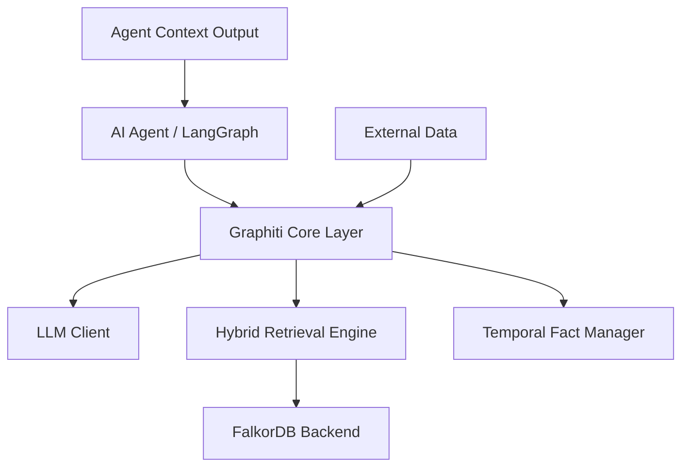
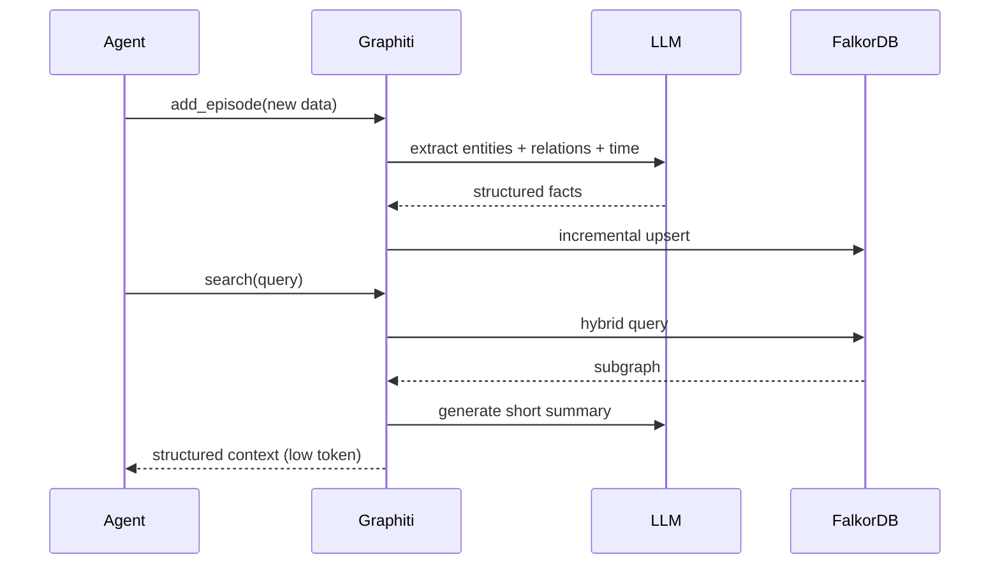

**Tài Liệu Yêu Cầu Sản Phẩm (PRD)**  
**Xây dựng Open-Source Knowledge Graph (KG) cho AI Agent**  
**Phiên bản 1.0**  
**Ngày: Tháng 3/2026**  
**Tác giả: Linh N. - Ho Chi Minh City**

---

### 1. Giới thiệu
Dự án nhằm xây dựng một **Knowledge Graph (KG) hoàn toàn open-source** dành riêng cho **AI Agent**. Hệ thống phải hỗ trợ **tìm kiếm**, **truy xuất** và **cập nhật** cây kiến thức một cách **hiệu quả, chính xác cao** và **tiết kiệm token** tối đa.

KG sẽ thay thế cách tiếp cận RAG truyền thống (nhét chunk text vào prompt), thay vào đó cung cấp **context có cấu trúc** (entities + relations + temporal facts) để giảm hallucination, hỗ trợ multi-hop reasoning và giữ lịch sử thay đổi theo thời gian.

### 2. Mục tiêu
- **Chức năng chính**: Agent có thể truy vấn multi-hop, lấy subgraph chính xác, cập nhật real-time mà không rebuild toàn bộ graph.
- **Tiết kiệm token**: Giảm 90-98% token so với naive RAG bằng cách chỉ trả về structured summary ngắn gọn.
- **Chính xác**: Hỗ trợ temporal reasoning (fact validity windows), hybrid search (vector + keyword + graph traversal).
- **Open-source 100%**: Apache-2.0 hoặc tương đương, chạy local/offline, dễ mở rộng.
- **Tích hợp**: Dễ kết nối với bất kỳ agent framework nào (LangGraph, LlamaIndex, AutoGen...).

### 3. Phạm vi
- **In-scope**: Temporal KG, hybrid retrieval, incremental update, Python primary stack, local LLM support (Ollama).
- **Out-of-scope**: Production multi-tenant SaaS, multimodal data (ảnh/video), frontend UI.

### 4. Yêu cầu chức năng
- Ingest episode/data mới -> tự động extract entity/relation + temporal facts.
- Update real-time: invalidate fact cũ, giữ lịch sử.
- Search: hybrid (semantic + keyword + graph traversal), trả về subgraph + summary ngắn.
- Query lịch sử: "Điều gì đúng vào thời điểm X?".
- Retrieve context cho agent: chỉ trả structured data (không raw text dài).
- Export/backup graph.

### 5. Yêu cầu phi chức năng
- Latency: sub-second cho search/update.
- Scale: từ vài nghìn nodes (laptop) đến hàng triệu nodes (production).
- Token efficiency: context trả về < 500 token/query.
- Offline-first: chạy hoàn toàn local.
- Ngôn ngữ chính: Python.
- License: open-source hoàn toàn.

### 6. Các giải pháp tiềm năng và so sánh
Bảng so sánh 5 giải pháp open-source nổi bật nhất năm 2026:

| Giải pháp | License | Temporal Support | Real-time Update | Token Efficiency | Accuracy (multi-hop) | Backend DB | Tích hợp Agent |
|-----------|---------|------------------|------------------|------------------|---------------------|------------|----------------|
| **Graphiti (Zep)** | Apache-2.0 | Xuất sắc | Xuất sắc | Xuất sắc (98% giảm) | Rất cao | FalkorDB / Neo4j | Xuất sắc |
| **Microsoft GraphRAG** | MIT | Trung bình | Tốt | Tốt | Xuất sắc (3.4x naive RAG) | Neo4j/FalkorDB | Tốt |
| **Neo4j + LlamaIndex PropertyGraph** | GPL/Commercial | Trung bình | Trung bình | Trung bình | Cao | Neo4j native | Tốt |
| **FalkorDB (với GraphRAG SDK)** | Source-available | Trung bình | Tốt | Tốt | Rất cao | FalkorDB native | Tốt |
| **Cognee** | Open-source | Trung bình | Tốt | Tốt | Cao | Vector + Graph | Tốt |

**Kết luận**: Graphiti vượt trội về temporal + real-time update + token saving. Microsoft GraphRAG mạnh về accuracy tĩnh. FalkorDB là backend tối ưu nhất năm 2026.

### 7. Giải pháp khuyến nghị
**Graphiti + FalkorDB backend** (hoặc Neo4j nếu cần enterprise features).  
Ngôn ngữ: **Python**.  
Agent orchestration: LangGraph hoặc LlamaIndex Workflows.  
LLM: Ollama (local) hoặc Groq/OpenAI.

### 8. Kiến trúc hệ thống (Mermaid)

### 9. Luồng dữ liệu chính (Mermaid)

### 10. Roadmap gợi ý
- Phase 1 (1-2 tuần): Setup Graphiti + FalkorDB, ingest dữ liệu mẫu.
- Phase 2 (2 tuần): Tích hợp vào agent framework, test hybrid search.
- Phase 3 (1 tuần): Temporal query + token optimization.
- Phase 4: Production hardening (backup, monitoring).

### 11. Phụ lục & Tài liệu tham khảo
- Graphiti GitHub: https://github.com/getzep/graphiti
- Microsoft GraphRAG: https://microsoft.github.io/graphrag/
- FalkorDB: https://www.falkordb.com/
