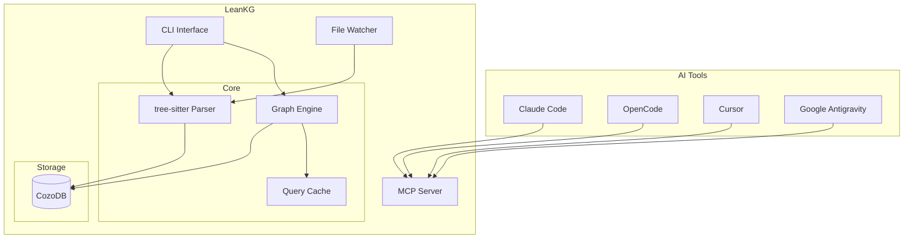

# Tech Stack

| Component | Technology |
|-----------|------------|
| Language | Rust |
| Database | CozoDB (embedded relational-graph, Datalog queries) |
| Parsing | tree-sitter |
| CLI | Clap |
| Web Server | Axum |

# Project Structure

```
src/
  cli/         - CLI commands (Clap)
  config/      - Project configuration
  db/          - CozoDB persistence layer
  doc/         - Documentation generator
  graph/       - Graph query engine
  indexer/     - Code parser (tree-sitter)
  doc_indexer/ - Documentation indexer
  mcp/         - MCP protocol handler
  watcher/     - File change watcher
  web/         - Web server (Axum)

docs/
  planning/    - Planning documents
  requirement/ - Requirements documents (PRD)
  analysis/    - Analysis documents
  design/      - Design documents (HLD)
  business/    - Business logic documents
```

# Supported Languages

LeanKG supports indexing and analysis for the following languages:

| Language | Extensions | Support Level |
|----------|------------|---------------|
| Go | `.go` | Full - functions, structs, interfaces, imports, calls |
| TypeScript | `.ts`, `.tsx` | Full - functions, classes, imports, calls |
| JavaScript | `.js`, `.jsx` | Full - functions, classes, imports, calls |
| Python | `.py` | Full - functions, classes, imports, calls |
| Rust | `.rs` | Full - functions, structs, traits, imports, calls |
| Java | `.java` | Full - classes, interfaces, methods, constructors, enums, imports, calls |
| Kotlin | `.kt`, `.kts` | Full - classes, objects, companion objects, functions, constructors, imports, calls |
| Ruby | `.rb` | Full - classes, modules, methods, imports, calls |
| PHP | `.php` | Full - classes, interfaces, properties, methods, calls |
| Perl | `.pl`, `.pm` | Full - packages, subs, imports, calls |
| R | `.r`, `.R` | Full - functions, assignments, imports |
| Elixir | `.ex`, `.exs` | Full - modules, functions, macros, structs, calls |
| Terraform | `.tf` | Full - resources, variables, outputs, modules |
| YAML | `.yaml`, `.yml` | Full - CI/CD pipelines, configurations |
| Markdown | `.md` | Full - documentation sections, code references |

# Architecture


